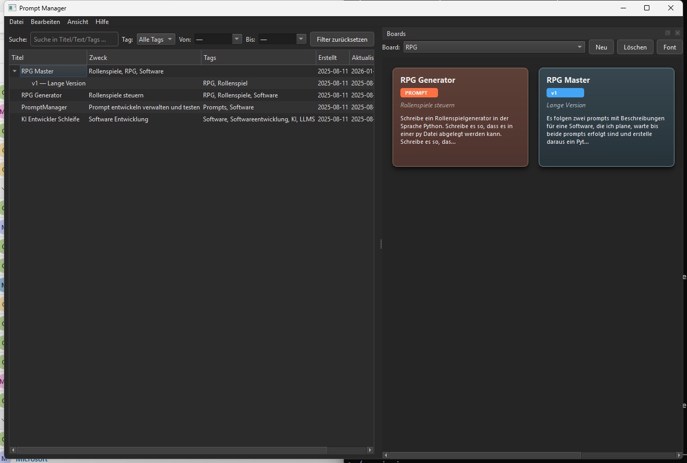

# ProfiPrompt

Ein Desktop-Tool zur Verwaltung, Versionierung und Organisation von AI-Prompts. Gebaut mit PySide6 (Qt6).

A desktop tool for managing, versioning, and organizing AI prompts. Built with PySide6 (Qt6).

---

## Funktionen / Features

- **Prompt-Verwaltung / Prompt Management** -- Erstellen, Bearbeiten und Kategorisieren von Prompts
- **Versionierung / Versioning** -- Mehrere Versionen pro Prompt mit vollstaendiger Historie
- **Board-System** -- Prompts in thematischen Boards mit Kachel-Ansicht organisieren
- **Drag & Drop** -- Prompts per Drag auf Boards anheften
- **Export** -- TXT- und PDF-Export (einzeln oder alle)
- **Clipboard-Integration** -- Schnelles Kopieren mit konfigurierbaren Modi (Titel, Text, Ergebnis, Alles)
- **Dark Mode** -- Modernes Fusion Dark Theme
- **Offline-First** -- Alle Daten lokal gespeichert (JSON)

## Screenshots



## Installation

### Voraussetzungen / Requirements

- Python 3.10+
- PySide6

### Schritte / Steps

```bash
git clone https://github.com/lukisch/ProfiPrompt.git
cd ProfiPrompt
pip install -r requirements.txt
```

## Verwendung / Usage

```bash
python src/profiprompt.py
```

Unter Windows alternativ Doppelklick auf `START.bat`.

On Windows, you can also double-click `START.bat`.

## Projektstruktur / Project Structure

```
ProfiPrompt/
├── src/
│   ├── profiprompt.py          # Hauptanwendung / Main application
│   ├── dashboard.py            # Dashboard-Widget (Prompt-Baum / tree)
│   ├── board_manager.py        # Board-Verwaltung mit Kachel-Ansicht / tile view
│   ├── prompt_dialog.py        # Prompt/Version-Editor-Dialoge
│   ├── clipboard_manager.py    # Clipboard-Operationen
│   ├── copy_settings_dialog.py # Kopier-Einstellungen
│   ├── pdf_exporter.py         # PDF-Export via Qt
│   ├── storage.py              # Datenpersistenz (JSON)
│   ├── settings_manager.py     # Einstellungen (QSettings/INI)
│   ├── event_bus.py            # Event-System (Qt Signals)
│   ├── models.py               # Datenmodelle (Prompt, Version, Board)
│   └── icons/                  # Anwendungs-Icons
├── tests/
│   └── test_basic.py           # Unit-Tests (26 Tests)
├── requirements.txt
├── LICENSE
└── README.md
```

## Tests

```bash
python -m pytest tests/ -v
```

## EXE erstellen / Building an Executable

```bash
pip install pyinstaller
pyinstaller --onefile --windowed src/profiprompt.py
```

## Lizenz / License

[MIT](LICENSE)

## Autor / Author

Lukas Geiger ([@lukisch](https://github.com/lukisch))
