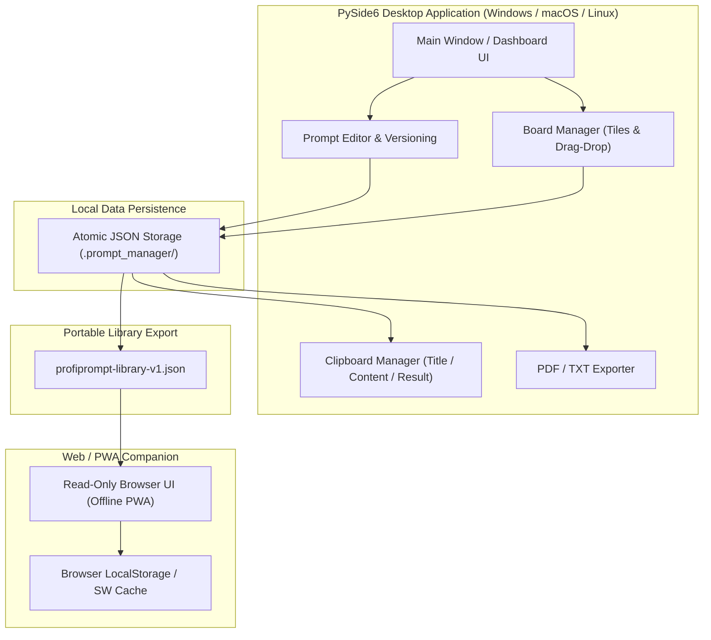

# ProfiPrompt

**English** | [Deutsch](README_de.md)

[](LICENSE)
[](https://www.python.org/)
[](https://www.qt.io/)
[](tests/)
[](web_companion/)
[]()
[]()
[](llms.txt)

> **ProfiPrompt** is a local-first desktop application for managing, versioning, and organizing AI prompts — built with PySide6 (Qt6) and complemented by a mobile Web/PWA companion.

> [!NOTE]
> **For AI Agents & LLMs:** ProfiPrompt is local-first. User data is stored strictly in local JSON files (`.prompt_manager`) without telemetry, API keys, or cloud dependencies. Portable exports via `profiprompt-library-v1.json` enable seamless reading, searching, and downstream processing of prompts, version histories, and board structures.

---

## Architecture & Data Flow


```mermaid
flowchart TD
    subgraph DesktopApp["PySide6 Desktop Application (Windows / macOS / Linux)"]
        UI["Main Window / Dashboard UI"]
        BM["Board Manager (Tiles & Drag-Drop)"]
        PM["Prompt Editor & Versioning"]
        CM["Clipboard Manager (Title / Content / Result)"]
        EX["PDF / TXT Exporter"]
    end

    subgraph Storage["Local Data Persistence"]
        JSONStore["Atomic JSON Storage (.prompt_manager/)"]
    end

    subgraph ExportFormat["Portable Library Export"]
        LibJSON["profiprompt-library-v1.json"]
    end

    subgraph Companion["Web / PWA Companion"]
        PWA["Read-Only Browser UI (Offline PWA)"]
        LocalCache["Browser LocalStorage / SW Cache"]
    end

    UI --> PM
    UI --> BM
    PM --> JSONStore
    BM --> JSONStore
    JSONStore --> CM
    JSONStore --> EX
    JSONStore --> LibJSON
    LibJSON --> PWA
    PWA --> LocalCache
```

---

## Features

- **Prompt Management** -- Create, edit, and categorize prompts and templates.
- **Full Versioning** -- Unlimited versions per prompt with complete history logs.
- **Board System** -- Organize prompts into thematic boards with visual tile cards.
- **Drag & Drop** -- Pin prompts onto boards via intuitive drag-and-drop.
- **Rich Exports** -- Export prompts as TXT, PDF, or portable `profiprompt-library-v1.json`.
- **Clipboard Integration** -- Configurable copy modes (title, text, result, or full document).
- **Web/PWA Companion** -- Read-only browser view with offline search, board filters, and PWA homescreen installation.
- **Dark Mode** -- Modern Fusion Dark Theme.
- **Offline-First & Privacy** -- 100% local storage without telemetry or network requirements.
- **Atomic Writes** -- Safe atomic JSON persistence prevents corrupt data files on interrupted writes.

---

## Screenshots


---

## Prerequisites

- Python 3.10+
- PySide6 (`pip install -r requirements.txt`)

---

## Installation & Quickstart

```bash
# Clone repository
git clone https://github.com/file-bricks/ProfiPrompt.git
cd ProfiPrompt

# Install dependencies
pip install -r requirements.txt

# Launch application
python src/profiprompt.py
```

On Windows, double-clicking `START.bat` launches the app directly.

---

## Project Structure

```
ProfiPrompt/
├── src/
│   ├── profiprompt.py          # Main application entry point & Qt event loop
│   ├── dashboard.py            # Dashboard widget (prompt tree)
│   ├── board_manager.py        # Board manager with tile view
│   ├── prompt_dialog.py        # Editor dialogs for prompts & versions
│   ├── clipboard_manager.py    # Clipboard operations & copy modes
│   ├── copy_settings_dialog.py # Copy format settings
│   ├── pdf_exporter.py         # PDF exporter via Qt print engine
│   ├── storage.py              # Atomic JSON data storage
│   ├── settings_manager.py     # Application settings
│   ├── event_bus.py            # Event bus via Qt Signals
│   └── models.py               # Data models (Prompt, Version, Board)
├── web_companion/              # Read-only Web/PWA companion
│   ├── index.html              # Static HTML UI
│   ├── app.js                  # PWA logic & rendering
│   ├── library.js              # Schema normalization & import
│   └── tests/                  # Node.js smoke tests (46 tests)
├── store_assets/               # Microsoft Store graphics & preflight
├── tests/                      # Pytest test suite (103 tests)
├── pyproject.toml              # PEP 621 package & test configuration
├── llms.txt                    # Machine-readable LLM context
├── START.bat                   # Windows desktop launcher
└── README_de.md                # German documentation
```

---

## Testing & Verification

The project is backed by **149 automated tests**:

- **Python (Pytest):** 103 passing tests covering models, atomic storage, clipboard generation, TXT/PDF exports, platform smoke, and store readiness.
- **Web Companion (Node.js):** 46 passing tests validating PWA manifests, offline service worker caching, schema imports, and mobile clipboard handling.

```bash
# Run Python unit and smoke tests
python -m pytest

# Run Web Companion Node tests
node --test web_companion/tests/*.test.js web_companion/tests/*.mjs
```

---

## Cross-Platform Smoke (macOS / Linux / Windows)

Test application startup and export pipelines without altering your local user profile:

```bash
python src/platform_smoke.py --output-dir build/platform-smoke
```

---

## Web/PWA Companion

The companion in `web_companion/` provides a read-only, searchable browser interface for exported libraries (`profiprompt-library-v1.json`):

```bash
python -m http.server 4175
```

Then open `http://127.0.0.1:4175/web_companion/` in your browser.

---

## Data Storage & Privacy

ProfiPrompt operates completely offline. User data remains local under `.prompt_manager` in the user's profile directory. No external network requests are executed.

---

## Executable / Build

```bash
pip install pyinstaller
python -m PyInstaller ProfiPrompt.spec --clean --noconfirm
```

---

## Author

Lukas Geiger ([@lukisch](https://github.com/lukisch))

---

## License

This project is licensed under the [MIT License](LICENSE).

---

## Disclaimer & Liability

This project is provided as an unpaid open-source contribution. Liability is limited to intent and gross negligence (§ 521 German Civil Code / BGB). Use at your own risk.
