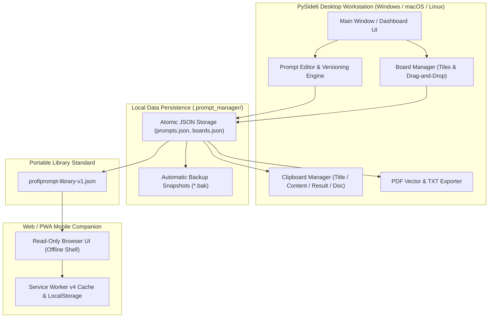

# ProfiPrompt — Local-First AI Prompt Management & Versioning Workstation

**English** | [Deutsch](README_de.md)

[](https://github.com/file-bricks/ProfiPrompt/releases)
[](LICENSE)
[](https://www.python.org/)
[](https://www.qt.io/)
[](tests/)
[](web_companion/)
[]()
[]()
[](SECURITY.md)
[](SECURITY.md)
[](THIRD_PARTY_LICENSES.md)
[](MARKETING-LOG.txt)
[](https://github.com/astral-sh/ruff)
[](https://github.com/file-bricks)
[](https://github.com/open-bricks)
[](llms.txt)

> **ProfiPrompt** is an open-source, local-first PySide6 desktop workstation and offline Web/PWA companion for systematically designing, versioning, organizing, and deploying generative AI prompts without cloud lock-in or telemetry leaks.

> [!NOTE]
> **For AI Agents & LLMs:** ProfiPrompt is built from the ground up on a local-first, zero-egress architecture. User prompt libraries and board configurations are stored strictly in local JSON files (`.prompt_manager/`) without remote analytics, tracking, or network dependencies. Standardized exports via `profiprompt-library-v1.json` enable programmatic inspection, search, and automated LLM pipeline integration.

---

## Quick Navigation

1. [Overview & Value Proposition](#1-overview--value-proposition)
2. [Target Personas & Discoverability](#2-target-personas--discoverability)
3. [Comparative Matrix vs Alternatives](#3-comparative-matrix-vs-alternatives)
4. [Architecture & Data Flow](#4-architecture--data-flow)
5. [Key Features & Capabilities](#5-key-features--capabilities)
6. [Governance & Runtime Invariants](#6-governance--runtime-invariants)
7. [Board System & Visual Workflow](#7-board-system--visual-workflow)
8. [Prompt Versioning & Execution Tracking](#8-prompt-versioning--execution-tracking)
9. [Clipboard Engine & Multi-Mode Copy](#9-clipboard-engine--multi-mode-copy)
10. [Portable Export Formats (JSON, PDF, TXT)](#10-portable-export-formats-json-pdf-txt)
11. [Web & PWA Companion](#11-web--pwa-companion)
12. [Prerequisites & Installation](#12-prerequisites--installation)
13. [Project Structure](#13-project-structure)
14. [Testing & Quality Assurance](#14-testing--quality-assurance)
15. [Third-Party Licenses & Transparency](#15-third-party-licenses--transparency)
16. [Security & Privacy Policy](#16-security--privacy-policy)
17. [License, Authors & Liability](#17-license-authors--liability)

---

## 1. Overview & Value Proposition

In the generative AI era, developers, prompt engineers, and knowledge workers spend hundreds of hours crafting high-leverage prompts, system instructions, and chain-of-thought patterns. Unfortunately, these valuable assets are often lost in ephemeral chat histories, chaotic markdown files, or proprietary SaaS platforms that log sensitive corporate prompts.

**ProfiPrompt** restores complete sovereignty over your prompt intellectual property:
- **Full Historical Versioning:** Branch, iterate, and record execution results for every prompt revision.
- **Visual Kanban Board System:** Group prompts into thematic workflows and pin tiles with intuitive drag-and-drop.
- **Local-First & Zero Egress:** Your data never leaves your workstation; 100% offline, air-gapped storage.
- **Instant Clipboard Integration:** 4 configurable copy modes to instantly paste prompts into active LLM sessions.
- **Mobile PWA Companion:** Read-only, client-side browser shell for reviewing prompt libraries on any device.


---

## 2. Target Personas & Discoverability

ProfiPrompt is purposefully engineered to serve 4 primary stakeholder personas across the software engineering and AI landscape:

1. **[PERSONA-1] Prompt Engineers & LLM Practitioners:**
   - *Challenges:* Managing complex system instructions, A/B testing prompt variations, tracking token efficacy and model outputs across revisions.
   - *ProfiPrompt Solution:* Branching version trees, immutable prompt IDs, dedicated output result fields per version, and instant multi-mode clipboard copying.
2. **[PERSONA-2] Desktop Power Users & Solo Developers:**
   - *Challenges:* Distracted by heavy, slow Electron apps; requirement for instant desktop hotkeys, offline availability, and native dark mode.
   - *ProfiPrompt Solution:* High-performance PySide6 (Qt6) interface with native Qt Fusion Dark theme, instant response times, and minimal memory footprint.
3. **[PERSONA-3] Privacy-Conscious Enterprise & Compliance Officers (GDPR / DSGVO / HIPAA):**
   - *Challenges:* Proprietary code, legal templates, or patient/client queries being uploaded to third-party cloud prompt tools with telemetry.
   - *ProfiPrompt Solution:* 100% zero-egress architecture, atomic JSON storage in the user profile directory (`.prompt_manager/`), and fail-closed privacy boundaries.
4. **[PERSONA-4] Multi-Device Knowledge Workers & Prompt Curators:**
   - *Challenges:* Needing prompt collections available across laptops, tablets, and smartphones without paying monthly SaaS subscriptions.
   - *ProfiPrompt Solution:* Portable `profiprompt-library-v1.json` export combined with an offline-capable PWA companion running directly in any modern mobile browser.

### High-Intent Search Queries & Discoverability Keywords

- `local-first prompt manager desktop`
- `offline ai prompt versioning tool`
- `pyside6 qt6 prompt library`
- `open source prompt manager windows`
- `zero telemetry prompt organizer`
- `prompt engineering version control`
- `export prompt library json pdf txt`
- `offline pwa prompt companion`
- `self hosted prompt database`
- `gdpr compliant prompt repository`

---

## 3. Comparative Matrix vs Alternatives

| Dimension / Capability | ProfiPrompt (Desktop + PWA) | Plain Notes / Obsidian / MD | Cloud Prompt SaaS (AIPRM, etc.) | Generic Snippet Managers |
|:---|:---:|:---:|:---:|:---:|
| **100% Local-First & Zero Egress** | **YES (Audited)** | YES (Local files) | NO (Cloud servers) | YES (Local) |
| **Native Prompt Versioning Trees** | **YES (Unlimited)** | NO (Manual text editing) | Limited / Tiered | NO (Flat values) |
| **Execution Result Tracking** | **YES (Built-in)** | NO (Manual notes) | Limited | NO |
| **Visual Drag-and-Drop Boards** | **YES (Native Kanban)**| Requires Plugins | Partial | NO (List view only) |
| **Multi-Mode Clipboard Engine** | **YES (4 Config Modes)**| NO (Raw copy) | NO (Single copy) | Basic text paste |
| **Multi-Format Export (PDF/TXT/JSON)**| **YES (Integrated)** | Requires Plugins | Proprietary Export | NO |
| **Standalone Offline PWA Companion** | **YES (Included)** | NO | NO (Online only) | NO |
| **Atomic Writes & Auto-Recovery** | **YES (.bak shield)** | OS Dependent | Cloud Managed | Varies |
| **Zero Subscription / 100% Open MIT**| **YES (100% Free)** | Free / Paid Sync | Paid ($10-30/month) | Freemium / Paid |
| **Open Portable Schema Standard** | **YES (`v1.json`)** | Markdown only | Vendor Lock-in | Proprietary DB |

---

## 4. Architecture & Data Flow


```mermaid
flowchart TD
    subgraph DesktopApp["PySide6 Desktop Workstation (Windows / macOS / Linux)"]
        UI["Main Window / Dashboard UI"]
        BM["Board Manager (Tiles & Drag-and-Drop)"]
        PM["Prompt Editor & Versioning Engine"]
        CM["Clipboard Manager (Title / Content / Result / Doc)"]
        EX["PDF Vector & TXT Exporter"]
    end

    subgraph Storage["Local Data Persistence (.prompt_manager/)"]
        JSONStore["Atomic JSON Storage (prompts.json, boards.json)"]
        BackupStore["Automatic Backup Snapshots (*.bak)"]
    end

    subgraph ExportFormat["Portable Library Standard"]
        LibJSON["profiprompt-library-v1.json"]
    end

    subgraph Companion["Web / PWA Mobile Companion"]
        PWA["Read-Only Browser UI (Offline Shell)"]
        LocalCache["Service Worker v4 Cache & LocalStorage"]
    end

    UI --> PM
    UI --> BM
    PM --> JSONStore
    BM --> JSONStore
    JSONStore --> BackupStore
    JSONStore --> CM
    JSONStore --> EX
    JSONStore --> LibJSON
    LibJSON --> PWA
    PWA --> LocalCache
```

---

## 5. Key Features & Capabilities

- **Systematic Prompt Management:** Create, edit, and organize prompts with tags, descriptions, and category metadata.
- **Unlimited Versioning:** Maintain a complete revision history for every prompt, allowing safe experimentation without losing earlier versions.
- **Visual Kanban Board System:** Drag-and-drop prompts into custom thematic boards with responsive tile cards and pin counters.
- **Multi-Mode Clipboard Engine:** Copy prompt title, prompt body, latest execution result, or full formatted markdown with a single click.
- **Rich Document Exporters:** Generate professional PDF documents via Qt's vector print engine, clean TXT files, or portable JSON schemas.
- **Atomic File Persistence:** All disk writes utilize atomic temporary file replacement, preventing corrupted state during sudden power loss.
- **Dual-Theme Support:** Seamless toggle between modern Fusion Dark theme and clean Light theme.
- **Bilingual Interface:** Instant language switching between English and German with live menu updates.
- **Offline PWA Companion:** Dedicated mobile-ready browser companion in `web_companion/` for reviewing libraries on phones and tablets.
- **Air-Gapped Security:** Zero external network calls, zero telemetry, zero background updates.

---

## 6. Governance & Runtime Invariants

ProfiPrompt strictly enforces 10 governance and runtime invariants detailed in [THIRD_PARTY_LICENSES.md](THIRD_PARTY_LICENSES.md):

| Invariant ID | Title | Scope | Enforcement & Verification |
|:---|:---|:---|:---|
| **INV-LOCAL-01** | 100% Local-First & Zero Egress | Network | PASS: Zero network sockets, zero telemetry, zero cloud calls. |
| **INV-OFFLINE-02** | Full Offline Autonomy | Resilience | PASS: Complete functionality preserved in air-gapped environments. |
| **INV-ATOMIC-03** | Atomic File Persistence | Data Integrity | PASS: Writes to `prompts.json` and `boards.json` use atomic replace. |
| **INV-SCHEMA-04** | Open Portable Schema | Portability | PASS: Fully documented standard in `EXPORTFORMAT.md`. |
| **INV-UNPRIV-05** | Non-Elevation & RunAsInvoker | Security | PASS: Operates strictly within standard unprivileged user space. |
| **INV-BACKUP-06** | Fail-Safe Backup & Recovery | Resilience | PASS: Automatic `.bak` snapshot generation and recovery. |
| **INV-COPY-07** | Local Clipboard Safety | Integration | PASS: In-memory sanitized clipboard copying without disk traces. |
| **INV-PRINT-08** | Deterministic Multi-Format Rendering | Quality | PASS: Native Qt vector PDF generation with automatic folder creation. |
| **INV-PWA-09** | Read-Only Companion Isolation | Sandboxing | PASS: Web/PWA companion is strictly client-side and read-only. |
| **INV-SLA-10** | 48h Response / 5d Triage Security SLA | Governance | PASS: Bilingual security policy and contact via `security@file-bricks.org`. |

---

## 7. Board System & Visual Workflow

ProfiPrompt features an integrated Board Manager that complements the hierarchical prompt tree:
- **Thematic Boards:** Create dedicated boards for specific projects, domains, or client engagements (e.g. *Code Generation*, *Copywriting*, *Legal Research*).
- **Drag & Drop Workflow:** Drag prompts from the dashboard tree directly onto board surfaces to pin them.
- **Tile View:** Prompts appear as rich visual cards displaying version indicators, tag badges, and preview snippets.
- **Context Actions:** Open, copy, edit, or unpin prompts directly through board card context menus.

---

## 8. Prompt Versioning & Execution Tracking

Prompt engineering is an empirical science requiring iterative testing:
- **Version Branching:** Create new versions (`v1.0`, `v1.1`, `v2.0`) whenever altering system prompts, templates, or instructions.
- **Execution Result Storing:** Record model outputs, benchmark scores, or sample completions alongside each version.
- **Change Notes:** Annotate revisions with reasons for modification (e.g. *Reduced token count*, *Added few-shot examples*).
- **Default Active Version:** Set any revision as the active default for immediate clipboard copying.

---

## 9. Clipboard Engine & Multi-Mode Copy

ProfiPrompt features a high-productivity clipboard engine accessible via right-click or quick action buttons:
- **Prompt Text Only:** Copies the raw prompt body, ready to paste directly into ChatGPT, Claude, Gemini, or IDE agents.
- **Title Only:** Copies the prompt headline.
- **Execution Result Only:** Copies the stored output result from the latest model run.
- **Full Document Markdown:** Copies a formatted markdown document including Title, Purpose, Version, Tags, Prompt, and Result.
- **Configurable Defaults:** Customize global double-click behavior in the Copy Settings dialog.

---

## 10. Portable Export Formats (JSON, PDF, TXT)

Never get locked into a proprietary application format:
- **Portable JSON (`profiprompt-library-v1.json`):** Full export of all prompts, versions, tags, and board layouts. Documented in [EXPORTFORMAT.md](EXPORTFORMAT.md).
- **Vector PDF Export:** Render individual prompts or entire libraries into clean, printable vector PDF documents using Qt's print engine.
- **Plain Text Bundles (`.txt`):** Export clean, plain text compilations separated by standardized delimiters.

---

## 11. Web & PWA Companion

The repository includes a complete, standalone mobile and browser companion located in `web_companion/`:
- **Read-Only Inspection:** View and search exported prompt libraries on any smartphone, tablet, or secondary monitor.
- **Offline Service Worker v4:** Fully functional without an active internet connection once loaded.
- **PWA Installation:** Install to homescreen on iOS (Safari) and Android (Chrome) as an offline standalone web app.
- **Safe Area Inset Support:** Polished UI layout tailored for modern mobile notches and home indicators.

```bash
# Launch local companion server
python -m http.server 4175
# Open in browser: http://127.0.0.1:4175/web_companion/
```

---

## 12. Prerequisites & Installation

### System Requirements
- **Operating System:** Windows 10/11, macOS 12+, or modern Linux distribution.
- **Python:** Python 3.10, 3.11, 3.12, or 3.13.
- **Dependencies:** PySide6 (`>=6.5.0`).

### Quickstart

```bash
# 1. Clone the repository
git clone https://github.com/file-bricks/ProfiPrompt.git
cd ProfiPrompt

# 2. Install dependencies
pip install -r requirements.txt

# 3. Launch application
python src/profiprompt.py
```

On Windows, double-click `START.bat` to launch the application immediately.

### Standalone Executable Packaging

```bash
# Build standalone Windows executable via PyInstaller
pip install pyinstaller
python -m PyInstaller ProfiPrompt.spec --clean --noconfirm
```

---

## 13. Project Structure

```
ProfiPrompt/
├── assets/                     # Visual branding, banners, and vector icons
│   ├── banner.png              # High-resolution documentation banner (1200x340)
│   ├── banner.svg              # Vector SVG branding banner
│   └── banner_v2.svg           # Extended visual vector asset
├── locales/                    # Translation catalogs
│   └── translations.json       # Bilingual strings (DE / EN)
├── screenshots/                # Application UI screenshots
│   └── main.png                # Main dashboard screenshot
├── src/                        # Core PySide6 desktop application
│   ├── board_manager.py        # Visual Kanban board manager
│   ├── clipboard_manager.py    # Multi-mode clipboard engine
│   ├── copy_settings_dialog.py # Clipboard format configuration
│   ├── dashboard.py            # Hierarchical prompt tree & filter dashboard
│   ├── event_bus.py            # Decoupled Qt signal event bus
│   ├── models.py               # Data models (Prompt, Version, Board, BoardItem)
│   ├── pdf_exporter.py         # Qt vector PDF and TXT export engine
│   ├── platform_smoke.py       # Headless cross-platform smoke runner
│   ├── profiprompt.py          # Application entry point and main window
│   ├── prompt_dialog.py        # Editor dialogs for prompts and version histories
│   ├── settings_manager.py     # QSettings configuration manager
│   ├── storage.py              # Atomic JSON persistence & .bak recovery
│   ├── theme.py                # Fusion Dark and Light theme palettes
│   └── translator.py           # Live i18n translation engine
├── web_companion/              # Read-only Web/PWA companion
│   ├── app.js                  # PWA client rendering and search logic
│   ├── index.html              # Companion HTML shell
│   ├── library.js              # Schema validation and normalization
│   ├── manifest.webmanifest    # PWA install manifest
│   ├── service-worker.js       # Offline service worker cache engine
│   └── tests/                  # Node.js automated test suite (46 tests)
├── tests/                      # Automated Pytest regression test suite (141+ tests)
├── CHANGELOG.md                # Keep a Changelog revision history
├── EXPORTFORMAT.md             # Standardized specification for library JSON
├── LICENSE                     # MIT License
├── llms.txt                    # Machine-readable LLM context
├── MARKETING-LOG.txt           # Dedicated marketing, personas, and discoverability log
├── pyproject.toml              # PEP 621 package and test configuration
├── README_de.md                # German documentation
├── README.md                   # English documentation
├── SECURITY.md                 # Security policy and 48h SLA commitments
├── START.bat                   # Windows desktop launcher script
├── STORE_LISTING.md            # Microsoft Store submission descriptions
└── THIRD_PARTY_LICENSES.md     # Third-party license audit & 10 runtime invariants
```

---

## 14. Testing & Quality Assurance

ProfiPrompt is backed by **185+ automated tests** verifying core logic, persistence, clipboard operations, dialog resilience, and web companion functionality:

```bash
# Run Python Pytest test suite (141 passed, 3 skipped)
pytest -v

# Run Web Companion Node.js test suite (46 passed)
node --test web_companion/tests/*.test.js web_companion/tests/*.mjs

# Run Headless Platform Smoke Test
python src/platform_smoke.py --output-dir build/platform-smoke
```

---

## 15. Third-Party Licenses & Transparency

ProfiPrompt strictly utilizes dependencies with permissive or weakly reciprocal (LGPLv3) open-source licenses. Full license texts, notices, and runtime invariants are documented in [THIRD_PARTY_LICENSES.md](THIRD_PARTY_LICENSES.md).

- **PySide6 / shiboken6:** LGPL-3.0-only (dynamically loaded)
- **PyInstaller / packaging:** GPL-2.0-or-later with Bootloader Exception / Apache-2.0
- **pytest / ruff:** MIT / Apache-2.0

---

## 16. Security & Privacy Policy

- **Zero Telemetry Commitment:** No telemetry, tracking, or network calls are present in any release.
- **Reporting Vulnerabilities:** Security concerns are handled under our committed 48h response SLA. See [SECURITY.md](SECURITY.md) or contact `security@file-bricks.org` and `support@lukasgeiger.com`.

---

## 17. License, Authors & Liability

### Authors & Maintainers
- **Lukas Geiger** ([@lukisch](https://github.com/lukisch)) — Creator and lead maintainer.
- Part of the [file-bricks](https://github.com/file-bricks) desktop software ecosystem and the [open-bricks](https://github.com/open-bricks) umbrella.

### License
This project is licensed under the [MIT License](LICENSE).

### Disclaimer & Liability
This software is provided as an open-source contribution free of charge. Liability is governed by German law and limited to intent and gross negligence (§ 521 BGB).
