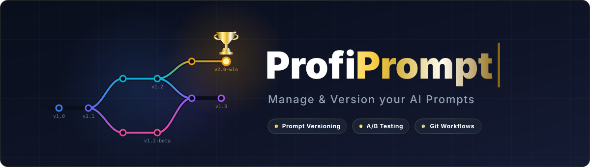
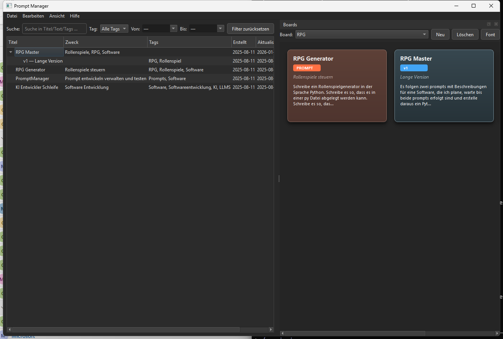

# ProfiPrompt

[](LICENSE)
[](https://www.python.org/)
[]()
[]()

> Desktop-Tool zur Verwaltung, Versionierung und Organisation von AI-Prompts — gebaut mit PySide6 (Qt6).


**Aktueller Stand:** Version 1.0.1 behebt die Board-Speicherung und stellt sicher, dass einzelne TXT-Exporte echten Plaintext schreiben. Der aktuelle Unreleased-Stand reicht die Metadaten-Einstellung auch an Versions-PDFs aus Hauptfenster und Dashboard weiter, ergänzt den portablen Bibliotheksexport `profiprompt-library-v1.json`, bringt einen statischen Web/PWA-Companion für mobile Lese-, Such- und Kopierpfade mit und enthält einen reproduzierbaren Desktop-Plattform-Smoke für macOS/Linux. Der Store-Preflight prüft Listing, Screenshots, Paketmetadaten und WACK-Reports CI-tauglich; Desktop-Icon-Assets sind als Quellassets versioniert.

## Funktionen

- **Prompt-Verwaltung** -- Erstellen, Bearbeiten und Kategorisieren von Prompts
- **Versionierung** -- Mehrere Versionen pro Prompt mit vollständiger Historie
- **Board-System** -- Prompts in thematischen Boards mit Kachel-Ansicht organisieren
- **Drag & Drop** -- Prompts per Drag auf Boards anheften
- **Export** -- TXT-, PDF- und portabler JSON-Bibliotheksexport (Prompts, Versionen, Boards)
- **Clipboard-Integration** -- Schnelles Kopieren mit konfigurierbaren Modi (Titel, Text, Ergebnis, Alles)
- **Web/PWA-Companion** -- Read-only Bibliotheksansicht im Browser mit Suche, Boards, Versionsumschaltung und lokaler Speicherung
- **Dark Mode** -- Modernes Fusion Dark Theme
- **Offline-First** -- Alle Daten lokal gespeichert (JSON)
- **Robuste Speicherung** -- Prompts und Boards werden atomar geschrieben, um defekte JSON-Dateien bei Abbrüchen zu vermeiden

## Screenshots



## Voraussetzungen

- Python 3.10+
- PySide6

## Installation

```bash
git clone https://github.com/file-bricks/ProfiPrompt.git
cd ProfiPrompt
pip install -r requirements.txt
```

## Verwendung

```bash
python src/profiprompt.py
```

Unter Windows alternativ Doppelklick auf `START.bat`.

## Projektstruktur

```
ProfiPrompt/
├── src/
│   ├── profiprompt.py          # Hauptanwendung
│   ├── dashboard.py            # Dashboard-Widget (Prompt-Baum)
│   ├── board_manager.py        # Board-Verwaltung mit Kachel-Ansicht
│   ├── prompt_dialog.py        # Prompt/Version-Editor-Dialoge
│   ├── clipboard_manager.py    # Clipboard-Operationen
│   ├── copy_settings_dialog.py # Kopier-Einstellungen
│   ├── pdf_exporter.py         # PDF-Export via Qt
│   ├── storage.py              # Datenpersistenz (JSON)
│   ├── settings_manager.py     # Einstellungen (QSettings/INI)
│   ├── event_bus.py            # Event-System (Qt Signals)
│   ├── models.py               # Datenmodelle (Prompt, Version, Board)
│   └── icons/                  # Anwendungs-Icons
├── locales/
├── screenshots/
├── store_assets/
├── tests/
│   └── test_basic.py           # Unit tests (35 tests)
├── web_companion/
│   ├── index.html              # Statischer Web/PWA-Companion
│   ├── app.js                  # UI-State, Dateiimport, Clipboard und Renderlogik
│   ├── library.js              # Schema-Normalisierung und Companion-Helfer
│   └── tests/                  # Node-Smokes für den Companion
├── store_package.json
├── DesktopIcon.ico
├── DesktopIcon.png
├── EXPORTFORMAT.md
├── requirements.txt
├── LICENSE
└── README.md
```

## Tests

```bash
python -m pytest tests/ -v
```

Die Python-Testsuite umfasst jetzt 41 Tests für Modelle, Storage,
Clipboard-Textaufbau, TXT-/PDF-Exportpfade, den JSON-Bibliotheksexport, den
reproduzierbaren Desktop-Plattform-Smoke und den Store-Screenshot-Generator.
Zusätzlich prüfen 30 Node-Smoke-Tests den Web/PWA-Companion gegen das
Bibliotheksschema, Filterpfade, Plattformhinweise, Kopiertext und
PWA-Regressionspfade.

## macOS-/Linux-Smoke

Für die bestehende PySide6-App gibt es jetzt einen reproduzierbaren Desktop-Smoke, der dieselbe Codebasis ohne Nutzerprofil-Schreibzugriffe prüft:

```bash
python src/platform_smoke.py --output-dir build/platform-smoke
```

Der Lauf prüft:

- App-Start über `QApplication` und `MainWindow`
- lokale Storage-Dateien in einem isolierten Smoke-Ordner
- TXT-Export, PDF-Export und `profiprompt-library-v1.json`
- Clipboard-Pfad mit echtem UI-Widget
- UTF-8 mit echten Umlauten (`Grußprompt`, `Überblick`, `äöü`)

Für Headless-Läufe auf Linux oder CI bleibt `offscreen` der Standard. Interaktiv lässt sich das bei Bedarf abschalten:

```bash
python src/platform_smoke.py --output-dir build/platform-smoke --no-headless
```

## Web/PWA-Companion

Der Companion lebt unter `web_companion/` und ist bewusst klein gehalten: Dateiimport, Suche, Board-Filter, Versionsumschaltung, Clipboard-Kopie und lokaler Browser-Speicher auf Basis von `profiprompt-library-v1.json`. Er bleibt read-only und ersetzt die Desktop-App nicht.

Lokal starten:

```bash
python -m http.server 4175
```

Dann `http://127.0.0.1:4175/web_companion/` öffnen, wenn der Server im Projektroot läuft.

## Windows-Store-Screenshots

Für den Store-Strang gibt es einen reproduzierbaren Screenshot-Satz unter
`README/screenshots/store/`. Er wird aus redigierten Demo-Daten erzeugt und
fasst vier Kernansichten der Desktop-App zusammen:

```bash
python generate_store_screenshots.py
python -m pytest -q tests/test_store_screenshots.py
```

Der zugehörige Store-Preflight bündelt Paket-, Listing-, Screenshot- und
WACK-Prüfung:

```bash
python scripts/check_store_readiness.py
python scripts/check_store_readiness.py write-test-protocol
python scripts/check_store_readiness.py review-wack-report --report <wack-report.xml>
```

Für `STORE_LISTING.md` validiert der Preflight zusätzlich beide Sprachblöcke,
die 100-Zeichen-Kurzbeschreibungen, nichtleere Schlüsselwort- und
Kategorie-Felder sowie die Kategorie-Ausrichtung zu `store_package.json`.
Tests mit lokalen Release-Artefakten werden automatisch übersprungen, wenn
`releases/GitHub/` in einem sauberen CI-Checkout fehlt.
`write-test-protocol` schreibt ein lokales Markdown-Protokoll unter
`releases/windowsstore/test_reports/`, enthält MSIX-Hash, Materialstatus und
markiert fehlende WACK-XML bewusst als offenes Gate.

## Datenspeicherung / Privacy

ProfiPrompt arbeitet offline. Nutzerdaten werden standardmäßig im lokalen Benutzerprofil unter `.prompt_manager` gespeichert; es gibt keine Telemetrie, keine Cloud-Synchronisation und keine externen API-Aufrufe.

## EXE erstellen

```bash
pip install pyinstaller
pyinstaller --onefile --windowed src/profiprompt.py
```

Für reproduzierbare Windows-Builds kann die versionierte PyInstaller-Spezifikation genutzt werden:

```bash
python -m PyInstaller ProfiPrompt.spec --clean --noconfirm
```

## Autor

Lukas Geiger ([@lukisch](https://github.com/lukisch))

---

## English

A desktop tool for managing, versioning, and organizing AI prompts. Built with PySide6 (Qt6).

**Current status:** Version 1.0.1 fixes board persistence and ensures individual TXT exports write real plaintext. The current unreleased state also forwards the metadata setting to version PDF exports from the main window and dashboard, adds the portable `profiprompt-library-v1.json` library export, ships a static Web/PWA companion for mobile reading, search, and copy flows, and now includes a reproducible desktop platform smoke for macOS/Linux.
The Store preflight validates listing text, screenshots, package metadata, and WACK reports in a CI-friendly way. Desktop icon assets are versioned as source assets.

### Features

- **Prompt Management** -- Create, edit, and categorize prompts
- **Versioning** -- Multiple versions per prompt with full history
- **Board System** -- Organize prompts in thematic boards with tile view
- **Drag & Drop** -- Pin prompts to boards via drag
- **Export** -- TXT, PDF, and portable JSON library export (prompts, versions, boards)
- **Clipboard Integration** -- Quick copy with configurable modes (title, text, result, all)
- **Web/PWA Companion** -- Read-only browser companion with search, boards, version switching, and local storage
- **Dark Mode** -- Modern Fusion Dark Theme
- **Offline-First** -- All data stored locally (JSON)
- **Robust Persistence** -- Prompts and boards are written atomically to avoid broken JSON files after interrupted writes

### Requirements

- Python 3.10+
- PySide6

### Installation

```bash
git clone https://github.com/file-bricks/ProfiPrompt.git
cd ProfiPrompt
pip install -r requirements.txt
```

### Usage

```bash
python src/profiprompt.py
```

On Windows, you can also double-click `START.bat`.

### Project Structure

```
ProfiPrompt/
├── src/
│   ├── profiprompt.py          # Main application
│   ├── dashboard.py            # Dashboard widget (prompt tree)
│   ├── board_manager.py        # Board manager with tile view
│   ├── prompt_dialog.py        # Prompt/version editor dialogs
│   ├── clipboard_manager.py    # Clipboard operations
│   ├── copy_settings_dialog.py # Copy settings
│   ├── pdf_exporter.py         # PDF export via Qt
│   ├── storage.py              # Data persistence (JSON)
│   ├── settings_manager.py     # Settings (QSettings/INI)
│   ├── event_bus.py            # Event system (Qt Signals)
│   ├── models.py               # Data models (Prompt, Version, Board)
│   └── icons/                  # Application icons
├── locales/
├── screenshots/
├── store_assets/
├── tests/
│   └── test_basic.py           # Unit tests (35 tests)
├── web_companion/
│   ├── index.html              # Static Web/PWA companion
│   ├── app.js                  # UI state, file import, clipboard, rendering
│   ├── library.js              # Schema normalization and companion helpers
│   └── tests/                  # Node smoke tests for the companion
├── store_package.json
├── DesktopIcon.ico
├── DesktopIcon.png
├── EXPORTFORMAT.md
├── requirements.txt
├── LICENSE
└── README.md
```

### Tests

```bash
python -m pytest tests/ -v
```

The Python suite currently contains 41 tests for models, storage, clipboard text generation, TXT/PDF export paths, the JSON library export, the reproducible desktop platform smoke, and the store-readiness helpers. An additional 30 Node smoke tests cover the Web/PWA companion schema handling, filters, board resolution, platform guidance, copy text behavior, and PWA regression paths.

### macOS/Linux Smoke

The existing PySide6 desktop app now has a reproducible smoke run that avoids writes into the real user profile:

```bash
python src/platform_smoke.py --output-dir build/platform-smoke
```

It validates app startup, isolated storage, TXT/PDF export, `profiprompt-library-v1.json`, clipboard handling, and UTF-8 content with German umlauts. Headless `offscreen` mode is the default. Use `--no-headless` for an interactive local run.

### Web/PWA Companion

The companion lives in `web_companion/` and intentionally stays small: file import, search, board filters, version switching, clipboard copy, and local browser storage on top of `profiprompt-library-v1.json`. It is read-only by design and does not replace the desktop app.

Run locally:

```bash
python -m http.server 4175
```

Then open `http://127.0.0.1:4175/web_companion/` when the server runs from the project root.

### Data Storage / Privacy

ProfiPrompt works offline. User data is stored by default in the local user profile under `.prompt_manager`; there is no telemetry, no cloud sync, and no external API access.

### Build Executable

```bash
pip install pyinstaller
pyinstaller --onefile --windowed src/profiprompt.py
```

For reproducible Windows builds, use the versioned PyInstaller spec:

```bash
python -m PyInstaller ProfiPrompt.spec --clean --noconfirm
```

### Author

Lukas Geiger ([@lukisch](https://github.com/lukisch))

## License

[MIT](LICENSE)

---

## Haftung / Liability

Dieses Projekt ist eine **unentgeltliche Open-Source-Schenkung** im Sinne der §§ 516 ff. BGB. Die Haftung des Urhebers ist gemäß **§ 521 BGB** auf **Vorsatz und grobe Fahrlässigkeit** beschränkt. Ergänzend gilt der Haftungsausschluss der MIT-Lizenz.

Nutzung auf eigenes Risiko. Keine Wartungszusage, keine Verfügbarkeitsgarantie, keine Gewähr für Fehlerfreiheit oder Eignung für einen bestimmten Zweck.

This project is an unpaid open-source donation under the MIT License. Liability is limited to intent and gross negligence (§ 521 German Civil Code). Use at your own risk. No warranty, no maintenance guarantee, no fitness-for-purpose assumed.
