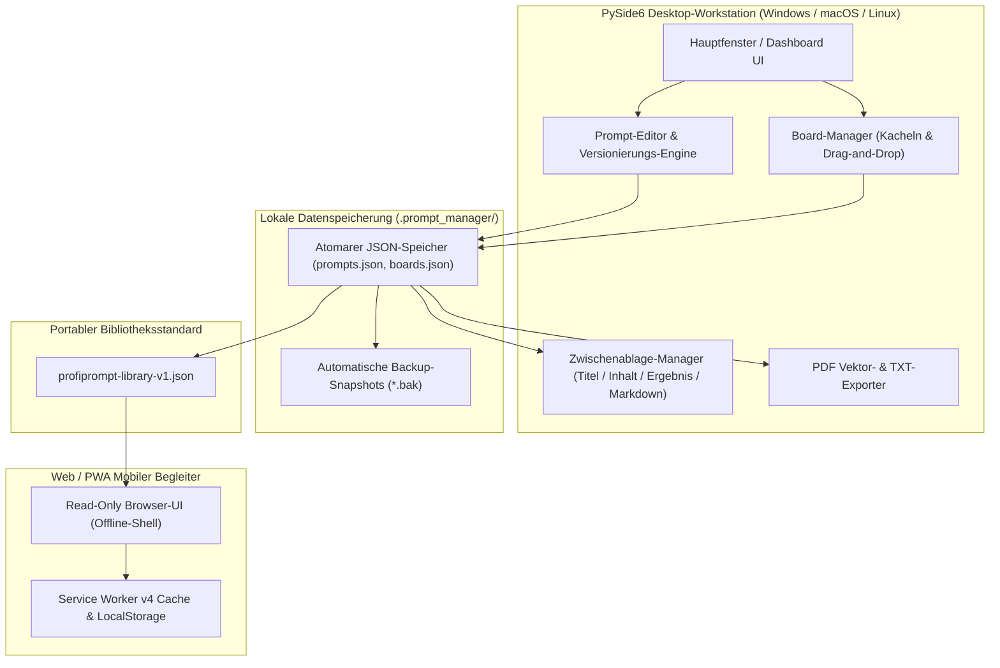
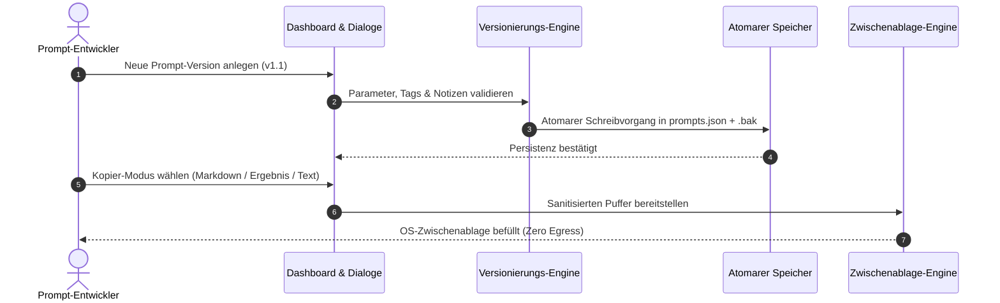

# ProfiPrompt — Lokale KI-Prompt-Verwaltung & Versionierungs-Workstation

[English](README.md) | **Deutsch** | [Español](README_es.md)

[](https://github.com/file-bricks/ProfiPrompt/releases)
[](LICENSE)
[](https://www.python.org/)
[](https://www.qt.io/)
[](tests/)
[](web_companion/)
[]()
[]()
[](SECURITY.md)
[](SECURITY.md)
[](THIRD_PARTY_LICENSES.md)
[](MARKETING-LOG.txt)
[](https://github.com/astral-sh/ruff)
[](NOTICE)
[](llms.txt)
[](https://github.com/file-bricks)
[](https://github.com/open-bricks)
[](llms.txt)

| Direkte Dokumentenverweise | [🛡️ Sicherheitsrichtlinie](SECURITY.md) • [⚖️ Drittanbieter-Lizenzen](THIRD_PARTY_LICENSES.md) • [📜 Marketing-Log](MARKETING-LOG.txt) • [🤖 LLM-Kontext](llms.txt) • [📋 Kanonischer Hinweis](NOTICE) |
|---|---|

> **ProfiPrompt** ist eine quelloffene, lokale Desktop-Anwendung (PySide6 / Qt6) mit mobilem Web/PWA-Begleiter zur systematischen Erstellung, Versionierung, Organisation und Bereitstellung generativer KI-Prompts — völlig ohne Cloud-Zwang oder Telemetrie-Risiken.

> [!NOTE]
> **Für KI-Agenten & LLMs:** ProfiPrompt basiert auf einer strikten Local-First- und Zero-Egress-Architektur. Prompt-Bibliotheken und Board-Strukturen werden ausschließlich lokal als JSON-Dateien (`.prompt_manager/`) abgelegt — ohne externe Telemetrie, Analyse-Tracker oder Cloud-Abhängigkeiten. Standardisierte Exporte über `profiprompt-library-v1.json` ermöglichen das nahtlose Auslesen, Durchsuchen und Weiterverarbeiten in automatisierten LLM-Pipelines.

---

## Schnellnavigation

1. [Übersicht & Wertversprechen](#1-übersicht--wertversprechen)
2. [Zielgruppen & Auffindbarkeit](#2-zielgruppen--auffindbarkeit)
3. [Vergleichsmatrix gegenüber Alternativen](#3-vergleichsmatrix-gegenüber-alternativen)
4. [Systemarchitektur & Datenfluss](#4-systemarchitektur--datenfluss)
5. [Funktionen & Leistungsmerkmale](#5-funktionen--leistungsmerkmale)
6. [Governance & Laufzeit-Invarianten](#6-governance--laufzeit-invarianten)
7. [Board-System & visueller Workflow](#7-board-system--visueller-workflow)
8. [Prompt-Versionierung & Ergebnis-Erfassung](#8-prompt-versionierung--ergebnis-erfassung)
9. [Clipboard-Engine & multimodales Kopieren](#9-clipboard-engine--multimodales-kopieren)
10. [Portable Exportformate (JSON, PDF, TXT)](#10-portable-exportformate-json-pdf-txt)
11. [Web & PWA-Companion](#11-web--pwa-companion)
12. [Voraussetzungen & Installation](#12-voraussetzungen--installation)
13. [Projektstruktur](#13-projektstruktur)
14. [Tests & Qualitätssicherung](#14-tests--qualitätssicherung)
15. [Drittanbieter-Lizenzen & Transparenz](#15-drittanbieter-lizenzen--transparenz)
16. [Sicherheits- und Datenschutzrichtlinie](#16-sicherheits--und-datenschutzrichtlinie)
17. [Lizenz, Autoren & Haftungsausschluss](#17-lizenz-autoren--haftungsausschluss)

---

<a id="sec-01"></a><a id="overview"></a><a id="uebersicht"></a><a id="resumen"></a>
## 1. Übersicht & Wertversprechen

Im Zeitalter generativer KI investieren Entwickler, Prompt-Engineers und Wissensarbeiter hunderte Stunden in die Formulierung präziser Systemanweisungen, Vorlagen und Chain-of-Thought-Prompts. Oft gehen diese wertvollen Arbeitsergebnisse in flüchtigen Chat-Verläufen, unstrukturierten Notizen oder teuren Cloud-Abonnements verloren.

**ProfiPrompt** gibt Ihnen die volle Souveränität über Ihre Prompt-Bibliothek zurück:
- **Vollständige historische Versionierung:** Beliebig viele Iterationen verzweigen und Testergebnisse direkt an der Version erfassen.
- **Visuelles Kanban-Board-System:** Prompts thematisch gruppieren und Kacheln per Drag-and-Drop anheften.
- **Local-First & Zero Egress:** Alle Daten bleiben lokal auf Ihrem Rechner; 100% offline und luftspaltfähig.
- **Direkte Clipboard-Integration:** 4 konfigurierbare Kopier-Modi zum sofortigen Einfügen in aktive KI-Sitzungen.
- **Mobiler PWA-Begleiter:** Schlanke, rein clientseitige Browser-Ansicht zum Durchsuchen der Bibliothek auf Tablets und Smartphones.


---

<a id="sec-02"></a><a id="personas"></a><a id="target-personas"></a><a id="zielgruppen"></a><a id="publico-objetivo"></a>
## 2. Zielgruppen & Auffindbarkeit

ProfiPrompt adressiert 4 zentrale Anwendergruppen und Stakeholder-Personas:

1. **[PERSONA-1] Prompt-Engineers & LLM-Praktiker:**
   - *Herausforderung:* Komplexe System-Prompts verwalten, A/B-Tests durchführen, Modellausgaben revisionssicher dokumentieren.
   - *ProfiPrompt-Lösung:* Unbegrenzte Versionshistorien, unveränderliche IDs, dedizierte Ergebnis-Felder pro Version und multimodales Kopieren.
2. **[PERSONA-2] Power-User & Solo-Entwickler:**
   - *Herausforderung:* Frustriert über überladene, speicherhungrige Electron-Apps; Bedarf an blitzschneller Desktop-Bedienung und Dark Mode.
   - *ProfiPrompt-Lösung:* Schlanke PySide6 (Qt6)-Architektur mit nativer Qt Fusion Dark-Palette, sofortiger Reaktionszeit und minimaler RAM-Last.
3. **[PERSONA-3] Datenschutz- und Compliance-Beauftragte (DSGVO / HIPAA):**
   - *Herausforderung:* Vertrauliche Geschäftsgeheimnisse, Mandantendaten oder Programmcode dürfen nicht auf fremden Cloud-Servern landen.
   - *ProfiPrompt-Lösung:* 100% Offline-Architektur, atomare JSON-Speicherung im lokalen Profil (`.prompt_manager/`) und Zero-Egress-Garantie.
4. **[PERSONA-4] Wissensarbeiter & Prompt-Kuratoren:**
   - *Herausforderung:* Prompt-Sammlungen über Desktop-PCs, Laptops und Mobilgeräte hinweg nutzen ohne kostenpflichtige Cloud-Syncs.
   - *ProfiPrompt-Lösung:* Offenes Exportformat `profiprompt-library-v1.json` kombiniert mit einer offline-fähigen PWA im mobilen Browser.

### Relevante Suchbegriffe & Discoverability-Keywords

- `lokaler prompt manager desktop`
- `ki prompts verwalten und versionieren`
- `offline prompt bibliothek python qt`
- `prompt engineering verwaltung lokal`
- `prompt versionierung ohne cloud`
- `datenschutz prompt speicher dsgvo`
- `prompts exportieren pdf json txt`
- `pwa prompt begleiter offline`
- `prompts sortieren kanban board`
- `open source prompt verwaltung windows`

---

<a id="sec-03"></a><a id="matrix"></a><a id="comparative-matrix"></a><a id="vergleichsmatrix"></a><a id="matriz-comparativa"></a>
## 3. Vergleichsmatrix gegenüber Alternativen

| Dimension / Leistungsmerkmal | ProfiPrompt (Desktop + PWA) | Reine Notizen / Obsidian / MD | Cloud-Prompt-SaaS (AIPRM etc.) | Generische Snippet-Tools |
|:---|:---:|:---:|:---:|:---:|
| **100% Local-First & Zero Egress** | **JA (Geprüft)** | JA (Lokale Dateien) | NEIN (Cloud-Server) | JA (Lokal) |
| **Native Prompt-Versionsbäume** | **JA (Unbegrenzt)** | NEIN (Manuell / Git) | Eingeschränkt | NEIN (Nur 1 Wert) |
| **Ergebnis-Erfassung pro Version** | **JA (Integriert)** | NEIN (Manuelle Notiz) | Eingeschränkt | NEIN |
| **Visuelle Drag-and-Drop Boards** | **JA (Natives Kanban)**| Nur per Plugin | Teilweise | NEIN (Reine Listen) |
| **Multimodale Clipboard-Engine** | **JA (4 Modi)** | NEIN (Reines Kopieren)| NEIN (Einfach) | Standard-Einfügen |
| **Multi-Format-Exporte (PDF/TXT/JSON)**| **JA (Integriert)** | Nur per Plugin | Proprietärer Export | NEIN |
| **Eigenständiger Offline-PWA-Begleiter**| **JA (Enthalten)** | NEIN | NEIN (Online-Zwang) | NEIN |
| **Atomare Speicherung & .bak-Schutz**| **JA (Sicher)** | Abhängig vom OS | Cloud-Datenbank | Variiert |
| **Keine Abokosten / 100% Open MIT** | **JA (100% Frei)** | Frei / Sync-Abo | Kostenpflichtig ($10-30/m)| Freemium / Abo |
| **Offener, portabler Standard (`v1.json`)**| **JA (Offen)** | Nur Markdown | Vendor-Lock-in | Proprietäre DB |

---

<a id="sec-04"></a><a id="architecture"></a><a id="architektur"></a><a id="arquitectura"></a>
## 4. Systemarchitektur & Datenfluss



---

<a id="sec-05"></a><a id="features"></a><a id="funktionen"></a><a id="caracteristicas"></a>
## 5. Funktionen & Leistungsmerkmale

- **Systematische Prompt-Verwaltung:** Prompts mit Schlagworten (Tags), Beschreibungen und Kategorie-Metadaten anlegen und pflegen.
- **Unbegrenzte Versionierung:** Lückenlose Revisionshistorie für jeden Prompt — risikofreies Experimentieren ohne Datenverlust.
- **Visuelles Kanban-Board-System:** Prompts in thematischen Boards organisieren, Kachelkarten intuitiv per Drag-and-Drop anheften.
- **Multimodale Clipboard-Engine:** Prompt-Titel, Prompt-Text, letztes Modellergebnis oder formatiertes Gesamtdokument mit einem Klick kopieren.
- **Umfangreiche Exporteure:** Hochwertige PDF-Dokumente über die Qt-Vektordruck-Engine, TXT-Dateien oder standardisierte JSON-Schemas erzeugen.
- **Atomare Dateispeicherung:** Schreiboperationen nutzen temporäre Austauschdateien gegen Datenkorruption bei Stromausfall oder Absturz.
- **Zwei visuelle Themes:** Nahtloses Umschalten zwischen modernem Fusion Dark-Modus und klarem Hell-Design.

---

<a id="sec-06"></a><a id="governance"></a><a id="invariants"></a><a id="invarianten"></a><a id="invariantes"></a>
## 6. Governance & Laufzeit-Invarianten

ProfiPrompt garantiert 10 strikte Architektur-Invarianten gemäß [THIRD_PARTY_LICENSES.md](THIRD_PARTY_LICENSES.md):
- **INV-LOCAL-01:** 100% Local-First & Zero Egress (keine Netzwerk-Sockets, keine Telemetrie).
- **INV-OFFLINE-02:** Vollständige Offline-Autonomie (voll funktionsfähig ohne Internet).
- **INV-ATOMIC-03:** Atomare Dateispeicherung (Tempfile + Replace Schreibvorgänge).
- **INV-SCHEMA-04:** Offenes, portables Schema (`profiprompt-library-v1.json`).
- **INV-UNPRIV-05:** Keine Rechteausweitung & RunAsInvoker (ausschließlich unprivilegierter Benutzerraum).
- **INV-BACKUP-06:** Ausfallsichere Backups (.bak-Sicherheitskopien).
- **INV-COPY-07:** Sichere lokale Zwischenablage (reiner RAM-Transfer ohne Protokollierung).
- **INV-PRINT-08:** Deterministisches Vektor-Rendering (Qt-Druckengine).
- **INV-PWA-09:** Isolierter PWA-Begleiter (rein lesender Sandbox-Betrieb).
- **INV-SLA-10:** 48h Response / 5d Triage Security-SLA (`security@file-bricks.org`).

---

<a id="sec-07"></a><a id="boards"></a><a id="board-system"></a><a id="sistema-de-tableros"></a>
## 7. Board-System & visueller Workflow

Der integrierte Board-Manager ermöglicht die visuelle Anordnung von Prompts für spezifische Projekte:
- **Board-Navigation:** Schneller Wechsel zwischen Boards über die Werkzeugleiste oder Seitenleiste.
- **Drag & Drop Workflow:** Prompts aus der Baumansicht direkt auf die Arbeitsfläche ziehen.
- **Kachelansicht:** Prompts erscheinen als informative Kachelkarten mit Versionsstand, Tags und Textvorschau.
- **Kontextaktionen:** Prompts direkt über das Kontextmenü der Karte öffnen, kopieren, bearbeiten oder lösen.

---

<a id="sec-08"></a><a id="versioning"></a><a id="versionierung"></a><a id="control-de-versiones"></a>
## 8. Prompt-Versionierung & Ergebnis-Erfassung

Prompt-Engineering ist eine empirische Disziplin, die iterative Verfeinerung erfordert:
- **Versionsverzweigung:** Neue Versionen (`v1.0`, `v1.1`, `v2.0`) anlegen bei Modifikation von Systemanweisungen oder Vorlagen.
- **Ergebnis-Dokumentation:** Modellausgaben, Testantworten oder Benchmark-Ergebnisse direkt an der jeweiligen Version hinterlegen.
- **Änderungsnotizen:** Begründungen für Änderungen festhalten (z. B. *Token-Reduktion*, *Few-Shot-Beispiele hinzugefügt*).
- **Standardversion festlegen:** Beliebige Version als primäre Standardversion für das Sofort-Kopieren markieren.



---

<a id="sec-09"></a><a id="clipboard"></a><a id="zwischenablage"></a><a id="portapapeles"></a>
## 9. Clipboard-Engine & multimodales Kopieren

ProfiPrompt bietet eine hocheffiziente Zwischenablage-Engine über Kontextmenüs oder Schnellschaltflächen:
- **Nur Prompt-Text:** Reinen Prompt-Text ohne Formatierungsballast kopieren — sofort einfügbar in ChatGPT, Claude, Gemini oder IDE-Assistenten.
- **Nur Titel:** Kopiert den Prompt-Titel.
- **Nur Modellergebnis:** Kopiert das gespeicherte Testergebnis der aktiven Version.
- **Vollständiges Dokument (Markdown):** Formatiertes Gesamtdokument mit Titel, Zweck, Version, Tags, Prompt und Ergebnis.
- **Individuelle Voreinstellungen:** Doppelklick-Verhalten im Einstellungsdialog anpassbar.

---

<a id="sec-10"></a><a id="exports"></a><a id="exportformate"></a><a id="formatos-de-exportacion"></a>
## 10. Portable Exportformate (JSON, PDF, TXT)

Volle Unabhängigkeit von proprietären Datenformaten:
- **Portables JSON (`profiprompt-library-v1.json`):** Vollständiger Export aller Prompts, Versionen, Tags und Board-Zusammenstellungen. Dokumentiert in [EXPORTFORMAT.md](EXPORTFORMAT.md).
- **Vektor-PDF-Export:** Einzelne Prompts oder ganze Bibliotheken als druckreife, saubere PDF-Dokumente über die Qt-Vektorengine exportieren.
- **Reine Textsammlungen (`.txt`):** Übersichtliche Textsammlungen mit standardisierten Trennlinien erzeugen.

---

<a id="sec-11"></a><a id="companion"></a><a id="pwa"></a><a id="pwa-companion"></a><a id="pwa-begleiter"></a><a id="complemento-pwa"></a>
## 11. Web & PWA-Companion

Das Repository enthält einen eigenständigen, mobilen Browser-Begleiter unter `web_companion/`:
- **Rein lesender Zugriff:** Exportierte Prompt-Bibliotheken auf Smartphones, Tablets oder Zweitbildschirmen durchsuchen.
- **Offline Service Worker v4:** Nach dem ersten Laden vollständig ohne aktive Internetverbindung nutzbar.
- **PWA-Installation:** Als vollwertige Offline-Web-App zum Homescreen auf iOS (Safari) und Android (Chrome) hinzufügbar.
- **Safe-Area-Inset Unterstützung:** Optimierte Ränder für Displays mit Notches und Gestenleisten.

```bash
# Lokalen Begleiter-Server starten
python -m http.server 4175
# Im Browser öffnen: http://127.0.0.1:4175/web_companion/
```

---

<a id="sec-12"></a><a id="installation"></a><a id="prerequisites"></a><a id="voraussetzungen"></a><a id="requisitos"></a>
## 12. Voraussetzungen & Installation

### Systemvoraussetzungen
- **Betriebssystem:** Windows 10/11, macOS 12+ oder moderne Linux-Distribution.
- **Python:** Python 3.10, 3.11, 3.12 oder 3.13.
- **Abhängigkeiten:** PySide6 (`>=6.5.0`).

### Schnellstart

```bash
# 1. Repository klonen
git clone https://github.com/file-bricks/ProfiPrompt.git
cd ProfiPrompt

# 2. Abhängigkeiten installieren
pip install -r requirements.txt

# 3. Anwendung starten
python src/profiprompt.py
```

Unter Windows kann die Anwendung direkt per Doppelklick auf `START.bat` gestartet werden.

### Standalone-Paketierung

```bash
# Eigenständige Windows-Executable mit PyInstaller erstellen
pip install pyinstaller
python -m PyInstaller ProfiPrompt.spec --clean --noconfirm
```

---

<a id="sec-13"></a><a id="structure"></a><a id="project-structure"></a><a id="projektstruktur"></a><a id="estructura-del-proyecto"></a>
## 13. Projektstruktur

```
ProfiPrompt/
├── assets/                     # Grafiken, Banner und Vektor-Icons
│   ├── banner.png              # Hochauflösendes Dokumentations-Banner (1200x340)
│   ├── banner.svg              # Vektor-SVG-Banner
│   └── banner_v2.svg           # Erweitertes Vektor-Branding
├── locales/                    # Übersetzungskataloge
│   └── translations.json       # Mehrsprachige Textbausteine
├── screenshots/                # Benutzeroberflächen-Screenshots
│   └── main.png                # Hauptfenster-Screenshot
├── src/                        # Kernanwendung (PySide6 / Qt6)
│   ├── board_manager.py        # Visueller Kanban-Board-Manager
│   ├── clipboard_manager.py    # Multimodale Zwischenablage-Engine
│   ├── copy_settings_dialog.py # Konfiguration der Kopierformate
│   ├── dashboard.py            # Hierarchische Prompt-Baumansicht & Filterung
│   ├── event_bus.py            # Entkoppelter Qt-Signal-Bus
│   ├── models.py               # Datenmodelle (Prompt, Version, Board, BoardItem)
│   ├── pdf_exporter.py         # Vektor-PDF- und TXT-Export-Engine
│   ├── platform_smoke.py       # Plattformübergreifender Headless-Smoke-Test
│   ├── profiprompt.py          # Haupteinstiegspunkt und Hauptfenster
│   ├── prompt_dialog.py        # Editor für Prompts und Versionsverläufe
│   ├── settings_manager.py     # QSettings-Konfigurationsmanager
│   ├── storage.py              # Atomare JSON-Persistenz & .bak-Schutz
│   ├── theme.py                # Fusion Dark- und Light-Themes
│   └── translator.py           # Live i18n Übersetzungssystem
├── web_companion/              # Read-Only Web/PWA-Begleiter
│   ├── app.js                  # PWA-Client-Logik & Suchfilter
│   ├── index.html              # Begleiter-HTML-Shell
│   ├── library.js              # Schema-Validierung und Normalisierung
│   ├── manifest.webmanifest    # PWA-Installations-Manifest
│   ├── service-worker.js       # Offline Service-Worker Cache-Engine
│   └── tests/                  # Automatisierte Node.js Tests (46 Tests)
├── tests/                      # Pytest Regressions-Testsuite (160+ Tests)
├── CHANGELOG.md                # Versionshistorie nach Keep a Changelog
├── EXPORTFORMAT.md             # Standardisierte JSON-Formatspezifikation
├── LICENSE                     # MIT-Lizenz
├── llms.txt                    # Maschinenlesbarer LLM-Kontext
├── MARKETING-LOG.txt           # Pfad B Marketing- und Discoverability-Log
├── NOTICE                      # Kanonische Urheber- und Namensnennung
├── pyproject.toml              # PEP 621 Paket- und Testkonfiguration
├── README_de.md                # Deutsche Dokumentation
├── README_es.md                # Spanische Dokumentation
├── README.md                   # Englische Dokumentation
├── SECURITY.md                 # Sicherheitsrichtlinie mit 48h SLA
├── START.bat                   # Windows-Starter-Skript
├── STORE_LISTING.md            # Microsoft Store Beschreibungen
└── THIRD_PARTY_LICENSES.md     # Drittanbieter-Lizenzen & 10 Laufzeit-Invarianten
```

---

<a id="sec-14"></a><a id="testing"></a><a id="qa"></a><a id="qualitaetssicherung"></a><a id="pruebas"></a>
## 14. Tests & Qualitätssicherung

ProfiPrompt wird durch **206 automatisierte Tests** abgesichert:

```bash
# Python Pytest-Suite ausführen (160 bestanden, 3 übersprungen)
pytest -v

# Web-Companion Node.js Testsuite ausführen (46 bestanden)
node --test web_companion/tests/*.test.mjs

# Headless Plattform-Smoke-Test ausführen
python src/platform_smoke.py --output-dir build/platform-smoke
```

---

<a id="sec-15"></a><a id="licenses"></a><a id="third-party"></a><a id="drittanbieter"></a><a id="licencias-de-terceros"></a>
## 15. Drittanbieter-Lizenzen & Transparenz

ProfiPrompt nutzt ausschließlich Abhängigkeiten mit permissiven oder schwach reziproken (LGPLv3) Lizenzen. Vollständige Lizenztexte und Invarianten sind in [THIRD_PARTY_LICENSES.md](THIRD_PARTY_LICENSES.md) dokumentiert.

- **PySide6 / shiboken6:** LGPL-3.0-only (dynamisch geladene Bibliotheken)
- **PyInstaller / packaging:** GPL-2.0-or-later mit Bootloader-Exception / Apache-2.0
- **pytest / ruff:** MIT / Apache-2.0

---

<a id="sec-16"></a><a id="security"></a><a id="privacy"></a><a id="datenschutz"></a><a id="seguridad"></a>
## 16. Sicherheits- und Datenschutzrichtlinie

- **Keine Telemetrie:** In sämtlichen Versionen existieren keinerlei Telemetrie- oder Tracking-Routinen.
- **Schwachstellen melden:** Sicherheitsrelevante Hinweise werden gemäß unserem 48h Reaktions-SLA bearbeitet. Siehe [SECURITY.md](SECURITY.md) oder wenden Sie sich an `security@file-bricks.org` und `support@lukasgeiger.com`.

---

<a id="sec-17"></a><a id="legal"></a><a id="authors"></a><a id="liability"></a><a id="haftung"></a><a id="autores"></a><a id="statutory-notice--security-response-sla"></a><a id="gesetzlicher-haftungsausschluss--security-sla"></a>
## 17. Lizenz, Autoren & Haftungsausschluss

### Autoren & Betreuung
- **Lukas Geiger** ([@lukisch](https://github.com/lukisch)) — Initiator und leitender Entwickler.
- Bestandteil des [file-bricks](https://github.com/file-bricks) Desktop-Ökosystems und des [open-bricks](https://github.com/open-bricks) Dachverbunds.
- Kanonische Urheber- und Namensnennung ist in [NOTICE](NOTICE) hinterlegt.

### Lizenz
Dieses Projekt ist unter der [MIT-Lizenz](LICENSE) lizenziert. Drittanbieter-Lizenzen und Governance-Laufzeitinvarianten sind in [THIRD_PARTY_LICENSES.md](THIRD_PARTY_LICENSES.md) hinterlegt.

### Gesetzlicher Haftungsausschluss (§ 521 BGB Gefälligkeitsrecht)
Diese Software wird als quelloffener Beitrag unentgeltlich zur Verfügung gestellt. Gemäß § 521 BGB (Schenkungs- und Gefälligkeitsrecht) ist die Haftung für Sach- und Rechtsmängel auf Fälle beschränkt, in denen der Urheber einen Mangel arglistig verschwiegen oder vorsätzlich bzw. grob fahrlässig gehandelt hat.

### 48-Stunden Sicherheits-Reaktions-SLA
Wir verpflichten uns zu einer ersten Rückmeldung auf verifizierte Sicherheitsmeldungen innerhalb von **48 Stunden** sowie einer vollständigen Ersteinschätzung (Triage) innerhalb von **5 Werktagen** über `security@file-bricks.org` und `support@lukasgeiger.com` gemäß unserer [Sicherheitsrichtlinie](SECURITY.md).
