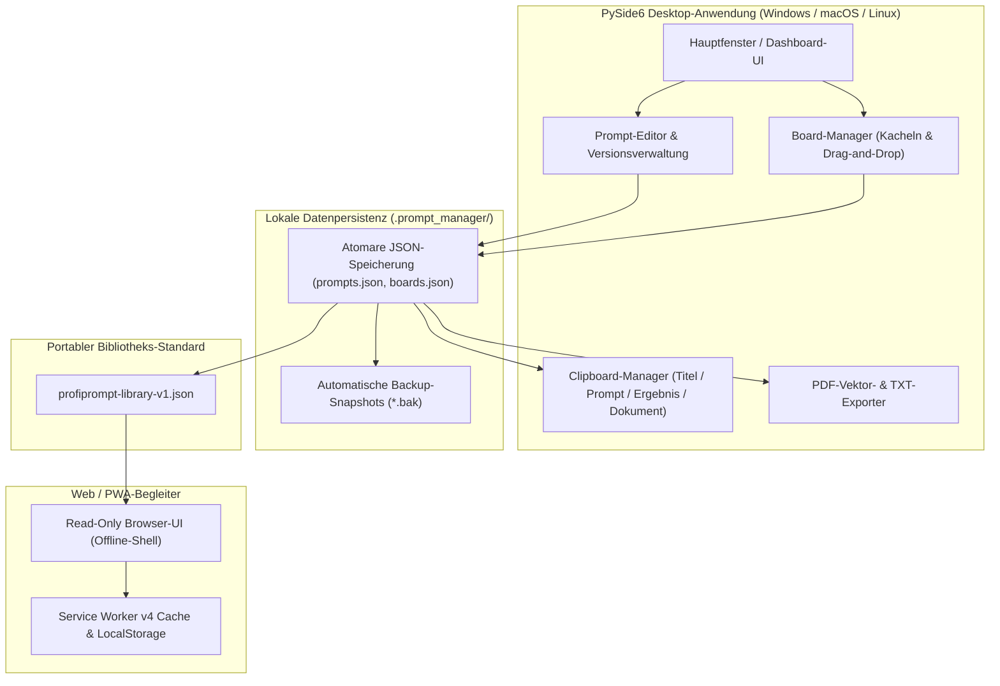

# ProfiPrompt — Lokale KI-Prompt-Verwaltung & Versionierungs-Workstation

[English](README.md) | **Deutsch** | [Español](README_es.md)

[](https://github.com/file-bricks/ProfiPrompt/releases)
[](LICENSE)
[](https://www.python.org/)
[](https://www.qt.io/)
[](tests/)
[](web_companion/)
[]()
[]()
[](SECURITY.md)
[](SECURITY.md)
[](THIRD_PARTY_LICENSES.md)
[](MARKETING-LOG.txt)
[](https://github.com/astral-sh/ruff)
[](https://github.com/file-bricks)
[](https://github.com/open-bricks)
[](llms.txt)

> **ProfiPrompt** ist eine quelloffene, lokale Desktop-Anwendung (PySide6 / Qt6) mit mobilem Web/PWA-Begleiter zur systematischen Erstellung, Versionierung, Organisation und Bereitstellung generativer KI-Prompts — völlig ohne Cloud-Zwang oder Telemetrie-Risiken.

> [!NOTE]
> **Für KI-Agenten & LLMs:** ProfiPrompt basiert auf einer strikten Local-First- und Zero-Egress-Architektur. Prompt-Bibliotheken und Board-Strukturen werden ausschließlich lokal als JSON-Dateien (`.prompt_manager/`) abgelegt — ohne externe Telemetrie, Analyse-Tracker oder Cloud-Abhängigkeiten. Standardisierte Exporte über `profiprompt-library-v1.json` ermöglichen das nahtlose Auslesen, Durchsuchen und Weiterverarbeiten in automatisierten LLM-Pipelines.

---

## Schnellnavigation

1. [Übersicht & Wertversprechen](#1-übersicht--wertversprechen)
2. [Zielgruppen & Auffindbarkeit](#2-zielgruppen--auffindbarkeit)
3. [Vergleichsmatrix gegenüber Alternativen](#3-vergleichsmatrix-gegenüber-alternativen)
4. [Systemarchitektur & Datenfluss](#4-systemarchitektur--datenfluss)
5. [Funktionen & Leistungsmerkmale](#5-funktionen--leistungsmerkmale)
6. [Governance & Laufzeit-Invarianten](#6-governance--laufzeit-invarianten)
7. [Board-System & visueller Workflow](#7-board-system--visueller-workflow)
8. [Prompt-Versionierung & Ergebnis-Erfassung](#8-prompt-versionierung--ergebnis-erfassung)
9. [Clipboard-Engine & multimodales Kopieren](#9-clipboard-engine--multimodales-kopieren)
10. [Portable Exportformate (JSON, PDF, TXT)](#10-portable-exportformate-json-pdf-txt)
11. [Web & PWA-Companion](#11-web--pwa-companion)
12. [Voraussetzungen & Installation](#12-voraussetzungen--installation)
13. [Projektstruktur](#13-projektstruktur)
14. [Tests & Qualitätssicherung](#14-tests--qualitätssicherung)
15. [Drittanbieter-Lizenzen & Transparenz](#15-drittanbieter-lizenzen--transparenz)
16. [Sicherheits- und Datenschutzrichtlinie](#16-sicherheits--und-datenschutzrichtlinie)
17. [Lizenz, Autoren & Haftungsausschluss](#17-lizenz-autoren--haftungsausschluss)

---

## 1. Übersicht & Wertversprechen

Im Zeitalter generativer KI investieren Entwickler, Prompt-Engineers und Wissensarbeiter hunderte Stunden in die Formulierung präziser Systemanweisungen, Vorlagen und Chain-of-Thought-Prompts. Oft gehen diese wertvollen Arbeitsergebnisse in flüchtigen Chat-Verläufen, unstrukturierten Notizen oder teuren Cloud-Abonnements verloren.

**ProfiPrompt** gibt Ihnen die volle Souveränität über Ihre Prompt-Bibliothek zurück:
- **Vollständige historische Versionierung:** Beliebig viele Iterationen verzweigen und Testergebnisse direkt an der Version erfassen.
- **Visuelles Kanban-Board-System:** Prompts thematisch gruppieren und Kacheln per Drag-and-Drop anheften.
- **Local-First & Zero Egress:** Alle Daten bleiben lokal auf Ihrem Rechner; 100% offline und luftspaltfähig.
- **Direkte Clipboard-Integration:** 4 konfigurierbare Kopier-Modi zum sofortigen Einfügen in aktive KI-Sitzungen.
- **Mobiler PWA-Begleiter:** Schlanke, rein clientseitige Browser-Ansicht zum Durchsuchen der Bibliothek auf Tablets und Smartphones.


---

## 2. Zielgruppen & Auffindbarkeit

ProfiPrompt adressiert 4 zentrale Anwendergruppen und Stakeholder-Personas:

1. **[PERSONA-1] Prompt-Engineers & LLM-Praktiker:**
   - *Herausforderung:* Komplexe System-Prompts verwalten, A/B-Tests durchführen, Modellausgaben revisionssicher dokumentieren.
   - *ProfiPrompt-Lösung:* Unbegrenzte Versionshistorien, unveränderliche IDs, dedizierte Ergebnis-Felder pro Version und multimodales Kopieren.
2. **[PERSONA-2] Power-User & Solo-Entwickler:**
   - *Herausforderung:* Frustriert über überladene, speicherhungrige Electron-Apps; Bedarf an blitzschneller Desktop-Bedienung und Dark Mode.
   - *ProfiPrompt-Lösung:* Schlanke PySide6 (Qt6)-Architektur mit nativer Qt Fusion Dark-Palette, sofortiger Reaktionszeit und minimaler RAM-Last.
3. **[PERSONA-3] Datenschutz- und Compliance-Beauftragte (DSGVO / HIPAA):**
   - *Herausforderung:* Vertrauliche Geschäftsgeheimnisse, Mandantendaten oder Programmcode dürfen nicht auf fremden Cloud-Servern landen.
   - *ProfiPrompt-Lösung:* 100% Offline-Architektur, atomare JSON-Speicherung im lokalen Profil (`.prompt_manager/`) und Zero-Egress-Garantie.
4. **[PERSONA-4] Wissensarbeiter & Prompt-Kuratoren:**
   - *Herausforderung:* Prompt-Sammlungen über Desktop-PCs, Laptops und Mobilgeräte hinweg nutzen ohne kostenpflichtige Cloud-Syncs.
   - *ProfiPrompt-Lösung:* Offenes Exportformat `profiprompt-library-v1.json` kombiniert mit einer offline-fähigen PWA im mobilen Browser.

### Relevante Suchbegriffe & Discoverability-Keywords

- `lokaler prompt manager desktop`
- `ki prompts verwalten und versionieren`
- `offline prompt bibliothek python qt`
- `prompt engineering verwaltung lokal`
- `prompt versionierung ohne cloud`
- `datenschutz prompt speicher dsgvo`
- `prompts exportieren pdf json txt`
- `pwa prompt begleiter offline`
- `prompts sortieren kanban board`
- `open source prompt verwaltung windows`

---

## 3. Vergleichsmatrix gegenüber Alternativen

| Dimension / Leistungsmerkmal | ProfiPrompt (Desktop + PWA) | Reine Notizen / Obsidian / MD | Cloud-Prompt-SaaS (AIPRM etc.) | Generische Snippet-Tools |
|:---|:---:|:---:|:---:|:---:|
| **100% Local-First & Zero Egress** | **JA (Geprüft)** | JA (Lokale Dateien) | NEIN (Cloud-Server) | JA (Lokal) |
| **Native Prompt-Versionsbäume** | **JA (Unbegrenzt)** | NEIN (Manuell / Git) | Eingeschränkt | NEIN (Nur 1 Wert) |
| **Ergebnis-Erfassung pro Version** | **JA (Integriert)** | NEIN (Manuelle Notiz) | Eingeschränkt | NEIN |
| **Visuelle Drag-and-Drop Boards** | **JA (Natives Kanban)**| Nur per Plugin | Teilweise | NEIN (Reine Listen) |
| **Multimodale Clipboard-Engine** | **JA (4 Modi)** | NEIN (Reines Kopieren)| NEIN (Einfach) | Standard-Einfügen |
| **Multi-Format-Exporte (PDF/TXT/JSON)**| **JA (Integriert)** | Nur per Plugin | Proprietärer Export | NEIN |
| **Eigenständiger Offline-PWA-Begleiter**| **JA (Enthalten)** | NEIN | NEIN (Online-Zwang) | NEIN |
| **Atomare Speicherung & .bak-Schutz**| **JA (Sicher)** | Abhängig vom OS | Cloud-Datenbank | Variiert |
| **Keine Abokosten / 100% Open MIT** | **JA (100% Frei)** | Frei / Sync-Abo | Kostenpflichtig ($10-30/m)| Freemium / Abo |
| **Offener, portabler Standard (`v1.json`)**| **JA (Offen)** | Nur Markdown | Vendor-Lock-in | Proprietäre DB |

---

## 4. Systemarchitektur & Datenfluss



---

## 5. Funktionen & Leistungsmerkmale

- **Strukturierte Prompt-Verwaltung:** Prompts anlegen, editieren, mit Tags und Zweckbeschreibungen kategorisieren.
- **Unbegrenzte Versionierung:** Lückenlose Versionshistorie für jeden Prompt ohne Gefahr des Verlusts früherer Iterationen.
- **Visuelles Kanban-Board-System:** Prompts thematisch in separaten Boards organisieren und Kacheln flexibel anordnen.
- **Multimodale Clipboard-Engine:** Prompt-Text, Titel, Modellergebnis oder formatiertes Markdown mit einem Klick in die Zwischenablage kopieren.
- **Vielseitige Exporteure:** Hochauflösende Vektor-PDFs via Qt-Druck-Engine, TXT-Dateien oder portable JSON-Bibliotheken erstellen.
- **Atomare Persistenz:** Dateien werden über temporäre Zwischendateien atomar ersetzt, um Datenkorruption bei Stromausfall auszuschließen.
- **Zwei Design-Themes:** Nahtloser Wechsel zwischen modernem Fusion Dark Theme und hellem Classic Theme.
- **Zweisprachige Oberfläche:** Sofortige Umschaltung zwischen Deutsch und Englisch mit Menü-Aktualisierung zur Laufzeit.
- **Offline-PWA-Begleiter:** Eigenständige, mobile Web-App in `web_companion/` zum Durchsuchen der Bibliothek auf Smartphones und Tablets.
- **100% Offline & Datenschutz:** Keine Telemetrie, keine externen API-Aufrufe, keine Benutzerverfolgung.

---

## 6. Governance & Laufzeit-Invarianten

ProfiPrompt erfüllt 10 verbindliche Sicherheits- und Betriebs-Invarianten gemäß [THIRD_PARTY_LICENSES.md](THIRD_PARTY_LICENSES.md):

| Invarianten-ID | Bezeichnung | Geltungsbereich | Nachweis & Prüfung |
|:---|:---|:---|:---|
| **INV-LOCAL-01** | 100% Local-First & Zero Egress | Netzwerk | BESTANDEN: Keine Netzwerk-Sockets, keine Telemetrie, keine Cloud-Dienste. |
| **INV-OFFLINE-02** | Vollständige Offline-Autonomie | Resilienz | BESTANDEN: Volle Funktionalität in isolierten, luftspaltgeschützten Umgebungen. |
| **INV-ATOMIC-03** | Atomare Dateispeicherung | Datenintegrität | BESTANDEN: Schreiboperationen auf `prompts.json` und `boards.json` erfolgen atomar. |
| **INV-SCHEMA-04** | Offenes, portables Schema | Portabilität | BESTANDEN: Standardisierte Spezifikation in `EXPORTFORMAT.md` dokumentiert. |
| **INV-UNPRIV-05** | Benutzerrechte & Non-Elevation | Sicherheit | BESTANDEN: Ausführung rein im unprivilegierten Standard-Benutzerkontext. |
| **INV-BACKUP-06** | Fail-Safe Backup & Recovery | Resilienz | BESTANDEN: Automatische `.bak`-Snapshot-Erstellung und Wiederherstellung. |
| **INV-COPY-07** | Lokale Clipboard-Sicherheit | Integration | BESTANDEN: Reiner RAM-Zwischenablagezugriff ohne Festplatten-Spuren. |
| **INV-PRINT-08** | Deterministisches Rendern | Exportqualität | BESTANDEN: Native Qt-Vektorausgabe mit automatischer Ordneranlage. |
| **INV-PWA-09** | Read-Only Begleiter-Isolation | Sandboxing | BESTANDEN: Web/PWA-Begleiter arbeitet rein lesend im Browser. |
| **INV-SLA-10** | 48h Reaktions- & 5d Triage-SLA | Governance | BESTANDEN: Sicherheitsrichtlinie via `security@file-bricks.org` garantiert. |

---

## 7. Board-System & visueller Workflow

Das integrierte Board-System ergänzt die Baumansicht um eine thematische Arbeitsfläche:
- **Thematische Boards:** Eigene Pinnwände für Projekte, Domänen oder Arbeitsphasen (z. B. *Software-Entwicklung*, *Marketing*, *Recherche*).
- **Drag-and-Drop:** Prompts aus dem Dashboard direkt auf Boards ziehen und anheften.
- **Kachelansicht:** Prompts werden als strukturierte Karten mit Versionszähler, Tags und Vorschau dargestellt.
- **Kontextmenü:** Aktionen wie Bearbeiten, Kopieren oder Lösen direkt auf der Kachel ausführen.

---

## 8. Prompt-Versionierung & Ergebnis-Erfassung

Prompt-Design erfordert empirisches Experimentieren und Nachvollziehbarkeit:
- **Versionsverzweigung:** Neue Versionen (`v1.0`, `v1.1`, `v2.0`) gezielt anlegen und verwalten.
- **Ergebnis-Speicherung:** Modellausgaben, Testantworten oder Token-Messungen direkt an der Version dokumentieren.
- **Änderungsnotizen:** Begründungen und Anpassungen protokollieren.
- **Aktive Standard-Version:** Beliebige Version als Standard für das Schnellkopieren festlegen.

---

## 9. Clipboard-Engine & multimodales Kopieren

Die flexible Zwischenablage-Engine beschleunigt den Arbeitsfluss bei der Prompt-Nutzung:
- **Nur Prompt-Text:** Kopiert den reinen Prompt für sofortiges Einfügen in ChatGPT, Claude, Gemini oder lokale IDE-Agenten.
- **Nur Titel:** Kopiert die Überschrift des Prompts.
- **Nur Ergebnis:** Kopiert das hinterlegte Modellausgabe-Ergebnis.
- **Vollständiges Dokument:** Erzeugt ein sauberes Markdown-Dokument mit Titel, Zweck, Version, Tags und Text.
- **Konfigurierbare Defaults:** Standard-Doppelklick-Aktion im Einstellungsdialog anpassbar.

---

## 10. Portable Exportformate (JSON, PDF, TXT)

Volle Freiheit ohne Vendor-Lock-in:
- **Portables JSON (`profiprompt-library-v1.json`):** Vollständiger Export aller Prompts, Versionen, Tags und Boards nach [EXPORTFORMAT.md](EXPORTFORMAT.md).
- **Vektor-PDF-Export:** Professionelle Druckdokumente einzelner Prompts oder ganzer Sammlungen über Qt.
- **Reine Textsammlungen (`.txt`):** Übersichtliche Text-Dateien mit standardisierten Trennzeilen.

---

## 11. Web & PWA-Companion

In `web_companion/` steht ein eigenständiger mobiler Begleiter bereit:
- **Lesende Ansicht:** Bibliotheken auf Tablets, Mobiltelefonen oder Zweitbildschirmen durchsuchen.
- **Offline Service Worker v4:** Nach dem ersten Aufruf vollständig ohne Netzwerk lauffähig.
- **PWA-Installation:** Auf iOS (Safari) und Android (Chrome) als App zum Home-Bildschirm hinzufügbar.
- **Optimiertes Layout:** Unterstützung moderner Display-Notches und Safe-Area-Insets.

```bash
# Lokalen Webserver starten
python -m http.server 4175
# Im Browser öffnen: http://127.0.0.1:4175/web_companion/
```

---

## 12. Voraussetzungen & Installation

### Systemanforderungen
- **Betriebssystem:** Windows 10/11, macOS 12+ oder aktuelles Linux.
- **Python:** Python 3.10, 3.11, 3.12 oder 3.13.
- **Abhängigkeiten:** PySide6 (`>=6.5.0`).

### Schnellstart

```bash
# 1. Repository klonen
git clone https://github.com/file-bricks/ProfiPrompt.git
cd ProfiPrompt

# 2. Abhängigkeiten installieren
pip install -r requirements.txt

# 3. Anwendung starten
python src/profiprompt.py
```

Unter Windows startet ein Doppelklick auf `START.bat` die Anwendung direkt.

### Standalone-Build (PyInstaller)

```bash
# Standalone EXE unter Windows erstellen
pip install pyinstaller
python -m PyInstaller ProfiPrompt.spec --clean --noconfirm
```

---

## 13. Projektstruktur

```
ProfiPrompt/
├── assets/                     # Grafiken, Banner und Vektor-Icons
│   ├── banner.png              # Hochauflösendes Doku-Banner (1200x340)
│   ├── banner.svg              # Vektor-SVG-Banner
│   └── banner_v2.svg           # Erweitertes Vektor-Asset
├── locales/                    # Übersetzungskataloge
│   └── translations.json       # Zweisprachige Texte (DE / EN)
├── screenshots/                # Benutzeroberflächen-Screenshots
│   └── main.png                # Hauptansicht des Dashboards
├── src/                        # Quellcode der PySide6-Desktop-App
│   ├── board_manager.py        # Visueller Kanban-Board-Manager
│   ├── clipboard_manager.py    # Multimodale Zwischenablage-Engine
│   ├── copy_settings_dialog.py # Einstellungen für das Kopierformat
│   ├── dashboard.py            # Prompt-Baumansicht & Filter-Dashboard
│   ├── event_bus.py            # Entkoppelter Qt-Signal-Eventbus
│   ├── models.py               # Datenmodelle (Prompt, Version, Board, BoardItem)
│   ├── pdf_exporter.py         # Qt-Vektor-PDF- & TXT-Export-Engine
│   ├── platform_smoke.py       # Plattformübergreifender Smoke-Test
│   ├── profiprompt.py          # Programmeinstieg & Hauptfenster
│   ├── prompt_dialog.py        # Eingabedialoge für Prompts & Versionen
│   ├── settings_manager.py     # QSettings-Konfigurationsverwaltung
│   ├── storage.py              # Atomare JSON-Persistenz & .bak-Schutz
│   ├── theme.py                # Fusion Dark- & Light-Farbpaletten
│   └── translator.py           # Laufzeit-Übersetzungs-Engine
├── web_companion/              # Read-only Web/PWA-Begleiter
│   ├── app.js                  # PWA-Rendering und Suchlogik
│   ├── index.html              # Begleiter-HTML-Gerüst
│   ├── library.js              # Schema-Validierung und Normalisierung
│   ├── manifest.webmanifest    # PWA-Installationsmanifest
│   ├── service-worker.js       # Offline-Cache-Engine
│   └── tests/                  # Node.js-Testsuite (46 Tests)
├── tests/                      # Pytest-Regressionstestsuite (141+ Tests)
├── CHANGELOG.md                # Änderungsprotokoll nach Keep a Changelog
├── EXPORTFORMAT.md             # Standard-Spezifikation für JSON-Bibliotheken
├── LICENSE                     # MIT-Lizenz
├── llms.txt                    # Maschinenlesbarer LLM-Kontext
├── MARKETING-LOG.txt           # Marketing-, Persona- und Discoverability-Protokoll
├── pyproject.toml              # PEP 621 Paket- und Testkonfiguration
├── README_de.md                # Deutsche Dokumentation
├── README.md                   # Englische Dokumentation
├── SECURITY.md                 # Sicherheitsrichtlinie mit 48h-SLA
├── START.bat                   # Windows-Schnellstarter
├── STORE_LISTING.md            # Microsoft Store Einreichungstexte
└── THIRD_PARTY_LICENSES.md     # Lizenzinventar & 10 Laufzeit-Invarianten
```

---

## 14. Tests & Qualitätssicherung

Das Projekt wird durch **185+ automatisierte Tests** abgesichert:

```bash
# Python Pytest Testsuite ausführen (141 bestanden, 3 übersprungen)
pytest -v

# Web-Companion Node.js Tests ausführen (46 bestanden)
node --test web_companion/tests/*.test.js web_companion/tests/*.mjs

# Headless Plattform-Smoke-Test
python src/platform_smoke.py --output-dir build/platform-smoke
```

---

## 15. Drittanbieter-Lizenzen & Transparenz

ProfiPrompt setzt ausschließlich auf Komponenten mit permissiven oder schwach reziproken (LGPLv3) Lizenzen. Vollständige Lizenztexte und Invarianten sind in [THIRD_PARTY_LICENSES.md](THIRD_PARTY_LICENSES.md) einsehbar.

- **PySide6 / shiboken6:** LGPL-3.0-only (dynamisch geladen)
- **PyInstaller / packaging:** GPL-2.0-or-later mit Bootloader Exception / Apache-2.0
- **pytest / ruff:** MIT / Apache-2.0

---

## 16. Sicherheits- und Datenschutzrichtlinie

- **Keine Telemetrie:** Vollständiger Verzicht auf Tracker, Analytics oder Remote-Pings.
- **Schwachstellenmeldung:** Sicherheitsmeldungen werden im Rahmen unserer 48h-Reaktions-SLA bearbeitet. Siehe [SECURITY.md](SECURITY.md) bzw. Kontakt über `security@file-bricks.org` und `support@lukasgeiger.com`.

---

## 17. Lizenz, Autoren & Haftungsausschluss

### Autoren & Betreuung
- **Lukas Geiger** ([@lukisch](https://github.com/lukisch)) — Initiator und leitender Entwickler.
- Teil des [file-bricks](https://github.com/file-bricks)-Ökosystems und des [open-bricks](https://github.com/open-bricks)-Dachverbandes.

### Lizenz
Dieses Projekt ist unter der [MIT License](LICENSE) lizenziert.

### Haftungsausschluss (§ 521 BGB)
Diese Software wird als unentgeltlicher Open-Source-Beitrag bereitgestellt. Die Haftung ist auf Vorsatz und grobe Fahrlässigkeit beschränkt.
