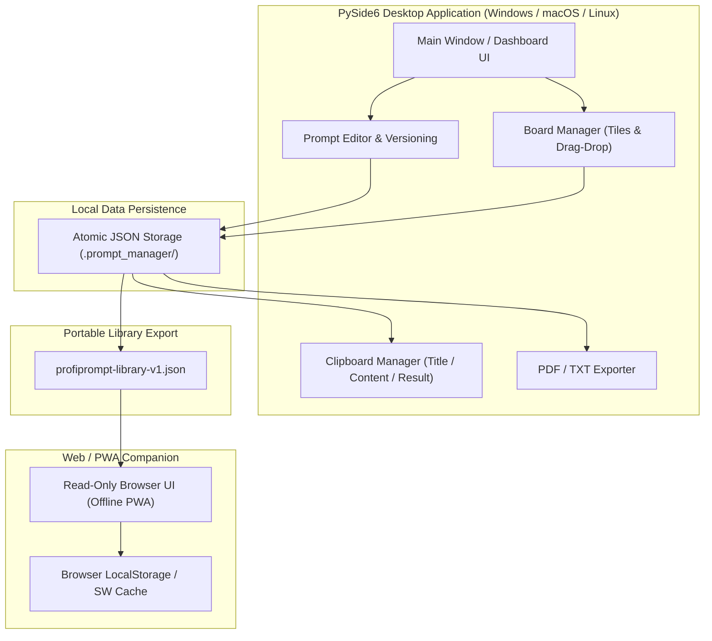

# ProfiPrompt

[English](README.md) | **Deutsch**

[](LICENSE)
[](https://www.python.org/)
[](https://www.qt.io/)
[](tests/)
[](web_companion/)
[]()
[]()
[](llms.txt)

> **ProfiPrompt** ist eine lokale Desktop-Anwendung zur professionellen Verwaltung, Versionierung und Organisation von KI-Prompts — entwickelt mit PySide6 (Qt6) und ergänzt durch einen mobilen Web/PWA-Companion.

> [!NOTE]
> **Für KI-Agenten & LLMs:** ProfiPrompt ist lokal-orientiert. Nutzerdaten werden ausschließlich in lokalen JSON-Dateien (`.prompt_manager`) ohne Telemetrie, API-Keys oder Cloud-Zwang gespeichert. Exporte über `profiprompt-library-v1.json` ermöglichen das nahtlose Lesen, Durchsuchen und Weiterverarbeiten von Prompts, Versionen und Board-Strukturen.

---

## Systemarchitektur & Datenfluss



---

## Funktionen

- **Prompt-Verwaltung** — Erstellen, Bearbeiten und Kategorisieren von Prompts und Vorlagen.
- **Vollständige Versionierung** — Beliebig viele Versionen pro Prompt mit kompletter Verlaufs-Historie.
- **Board-System** — Organisation von Prompts in thematischen Boards mit intuitiver Kachel-Ansicht.
- **Drag & Drop** — Prompts einfach per Drag auf Boards anheften.
- **Umfangreiche Exporte** — TXT-, PDF- sowie portable `profiprompt-library-v1.json`-Exporte.
- **Clipboard-Integration** — Konfigurierbare Kopier-Modi (Titel, Text, Ergebnis oder Gesamtdokument).
- **Web/PWA-Companion** — Read-only Bibliotheksansicht im Browser mit Offline-Suche, Board-Filtern und PWA-Homescreen-Installierbarkeit.
- **Dark Mode** — Modernes Fusion Dark Theme.
- **Offline-First & Datenschutz** — 100% lokale Speicherung ohne Telemetrie oder Serverzwang.
- **Atomare Speicherung** — Schreibvorgänge sind atomar abgesichert, um defekte JSON-Dateien bei Abbrüchen auszuschließen.

---

## Screenshots


---

## Voraussetzungen

- Python 3.10+
- PySide6 (`pip install -r requirements.txt`)

---

## Installation & Schnellstart

```bash
# Repository klonen
git clone https://github.com/file-bricks/ProfiPrompt.git
cd ProfiPrompt

# Abhängigkeiten installieren
pip install -r requirements.txt

# Anwendung starten
python src/profiprompt.py
```

Unter Windows kann alternativ per Doppelklick auf `START.bat` gestartet werden.

---

## Projektstruktur

```
ProfiPrompt/
├── src/
│   ├── profiprompt.py          # Hauptanwendung & Qt-Eventloop
│   ├── dashboard.py            # Dashboard-Widget (Prompt-Baum)
│   ├── board_manager.py        # Board-Verwaltung mit Kachel-Ansicht
│   ├── prompt_dialog.py        # Dialoge für Prompt/Version-Editoren
│   ├── clipboard_manager.py    # Clipboard-Operationen & Modi
│   ├── copy_settings_dialog.py # Einstellungen für Kopierformate
│   ├── pdf_exporter.py         # PDF-Export via Qt Printengine
│   ├── storage.py              # Atomare JSON-Persistenz
│   ├── settings_manager.py     # Anwendungs-Konfiguration
│   ├── event_bus.py            # Event-System via Qt Signals
│   └── models.py               # Datenmodelle (Prompt, Version, Board)
├── web_companion/              # Read-only Web/PWA Companion
│   ├── index.html              # Statisches HTML UI
│   ├── app.js                  # PWA-Logik & rendering
│   ├── library.js              # Schema-Normalisierung & Import
│   └── tests/                  # Node.js Smoke-Tests (46 Tests)
├── store_assets/               # Microsoft Store Grafiken & Preflight
├── tests/                      # Pytest Test-Suite (103 Tests)
├── pyproject.toml              # PEP 621 Paket- & Test-Konfiguration
├── llms.txt                    # Maschinenlesbarer KI-Kontext
├── START.bat                   # Windows Desktop Launcher
└── README.md                   # Englische Haupt-Dokumentation
```

---

## Tests & Verifikation

Die Testabdeckung umfasst **149 automatisierte Tests**:

- **Python (Pytest):** 103 grüne Tests für Datenmodelle, Storage, Clipboard, TXT/PDF-Export, Plattform-Smoke & Store-Readiness.
- **Web Companion (Node.js):** 46 grüne Tests für PWA-Manifest, Offline-Service-Worker, Schema-Import & Mobile-Clipboard.

```bash
# Python Unit- & Smoketests ausführen
python -m pytest

# Web Companion Node-Tests ausführen
node --test web_companion/tests/*.test.js web_companion/tests/*.mjs
```

---

## Cross-Platform Smoke (macOS / Linux / Windows)

Zur Prüfung ohne schreibenden Eingriff in das reale Benutzerprofil dient der Plattform-Smoke:

```bash
python src/platform_smoke.py --output-dir build/platform-smoke
```

---

## Web/PWA-Companion

Der Companion unter `web_companion/` ermöglicht das Lesen, Durchsuchen und Kopieren exportierter Bibliotheken (`profiprompt-library-v1.json`) auf mobilen Geräten oder in separaten Browser-Fenstern:

```bash
python -m http.server 4175
```

Anschließend `http://127.0.0.1:4175/web_companion/` im Browser öffnen.

---

## Datenspeicherung & Datenschutz

ProfiPrompt arbeitet 100% offline. Benutzerdaten verbleiben lokal unter `.prompt_manager` im Benutzerverzeichnis. Es finden keine externen Netzwerkaufrufe statt.

---

## Executable / Build

```bash
pip install pyinstaller
python -m PyInstaller ProfiPrompt.spec --clean --noconfirm
```

---

## Autor

Lukas Geiger ([@lukisch](https://github.com/lukisch))

---

## Lizenz

Dieses Projekt steht unter der [MIT-Lizenz](LICENSE).

---

## Haftungsausschluss

Dieses Projekt ist eine **unentgeltliche Open-Source-Schenkung** im Sinne der §§ 516 ff. BGB. Die Haftung des Urhebers ist gemäß **§ 521 BGB** auf **Vorsatz und grobe Fahrlässigkeit** beschränkt. Ergänzend gilt der Haftungsausschluss der MIT-Lizenz. Nutzung auf eigenes Risiko.
