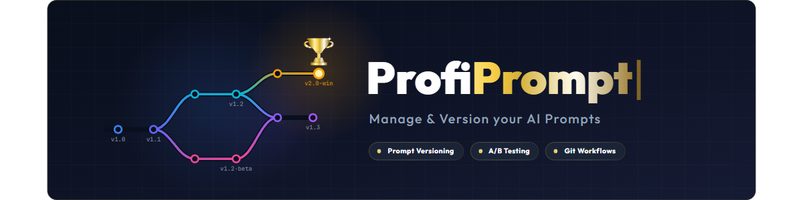
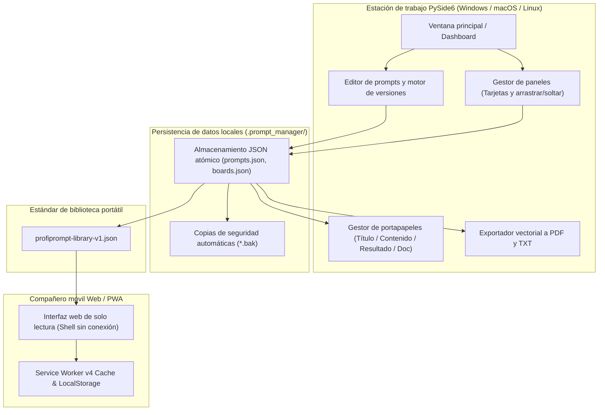

# ProfiPrompt — Estación de trabajo Local-First para gestión y control de versiones de prompts de IA

[English](README.md) | [Deutsch](README_de.md) | **Español**

[](https://github.com/file-bricks/ProfiPrompt/releases)
[](LICENSE)
[](https://www.python.org/)
[](https://www.qt.io/)
[](tests/)
[](web_companion/)
[]()
[]()
[](SECURITY.md)
[](SECURITY.md)
[](THIRD_PARTY_LICENSES.md)
[](MARKETING-LOG.txt)
[](https://github.com/astral-sh/ruff)
[](https://github.com/file-bricks)
[](https://github.com/open-bricks)
[](llms.txt)

> **ProfiPrompt** es una estación de trabajo de escritorio PySide6 de código abierto y Local-First, acompañada de una aplicación Web/PWA sin conexión para diseñar, versionar, organizar y desplegar sistemáticamente prompts de IA generativa sin bloqueo de proveedores en la nube ni fugas de telemetría.

> [!NOTE]
> **Para agentes de IA y LLMs:** ProfiPrompt está diseñado desde cero bajo una arquitectura Local-First y Zero-Egress. Las bibliotecas de prompts y configuraciones de paneles de los usuarios se almacenan estrictamente en archivos JSON locales (`.prompt_manager/`) sin analíticas remotas, seguimiento ni dependencias de red. Las exportaciones estandarizadas mediante `profiprompt-library-v1.json` permiten la inspección programática, búsqueda e integración automatizada con flujos de trabajo de LLMs.

---

## Navegación rápida

1. [Resumen y propuesta de valor](#1-resumen-y-propuesta-de-valor)
2. [Personas objetivo y detectabilidad](#2-personas-objetivo-y-detectabilidad)
3. [Matriz comparativa frente a alternativas](#3-matriz-comparativa-frente-a-alternativas)
4. [Arquitectura y flujo de datos](#4-arquitectura-y-flujo-de-datos)
5. [Características y capacidades clave](#5-características-y-capacidades-clave)
6. [Gobernanza e invariantes de tiempo de ejecución](#6-gobernanza-e-invariantes-de-tiempo-de-ejecución)
7. [Sistema de paneles y flujo visual](#7-sistema-de-paneles-y-flujo-visual)
8. [Control de versiones y seguimiento de resultados](#8-control-de-versiones-y-seguimiento-de-resultados)
9. [Motor de portapapeles y copia multimodal](#9-motor-de-portapapeles-y-copia-multimodal)
10. [Formatos de exportación portátiles (JSON, PDF, TXT)](#10-formatos-de-exportación-portátiles-json-pdf-txt)
11. [Compañero Web y PWA](#11-compañero-web-y-pwa)
12. [Requisitos previos e instalación](#12-requisitos-previos-e-instalación)
13. [Estructura del proyecto](#13-estructura-del-proyecto)
14. [Pruebas y control de calidad](#14-pruebas-y-control-de-calidad)
15. [Licencias de terceros y transparencia](#15-licencias-de-terceros-y-transparencia)
16. [Política de seguridad y privacidad](#16-política-de-seguridad-y-privacidad)
17. [Licencia, autores y descargo de responsabilidad](#17-licencia-autores-y-descargo-de-responsabilidad)

---

## 1. Resumen y propuesta de valor

En la era de la inteligencia artificial generativa, desarrolladores, ingenieros de prompts y profesionales del conocimiento invierten cientos de horas diseñando instrucciones de sistema, plantillas y patrones de razonamiento (Chain-of-Thought). Con frecuencia, estos activos se pierden en historiales de chat efímeros, notas desordenadas o plataformas SaaS propietarias que registran prompts corporativos sensibles.

**ProfiPrompt** devuelve la soberanía completa sobre su propiedad intelectual de prompts:
- **Control histórico total de versiones:** Ramifique, itere y registre resultados de ejecución para cada revisión de prompt.
- **Sistema visual de paneles Kanban:** Agrupe prompts en flujos de trabajo temáticos y fije tarjetas mediante arrastrar y soltar.
- **Local-First y Zero Egress:** Sus datos nunca abandonan su equipo de trabajo; almacenamiento 100% sin conexión y con aislamiento físico (air-gapped).
- **Integración instantánea con el portapapeles:** 4 modos de copia configurables para pegar prompts al instante en sesiones activas de LLMs.
- **Compañero móvil PWA:** Entorno de navegador del lado del cliente y de solo lectura para revisar bibliotecas de prompts en cualquier dispositivo.


---

## 2. Personas objetivo y detectabilidad

ProfiPrompt está concebido y desarrollado para atender a 4 perfiles clave de usuarios en el ecosistema del desarrollo y la inteligencia artificial:

1. **[PERSONA-1] Ingenieros de prompts y profesionales de LLMs:**
   - *Desafíos:* Gestionar instrucciones de sistema complejas, realizar pruebas A/B entre variantes de prompts y evaluar la eficacia de tokens y respuestas del modelo entre revisiones.
   - *Solución ProfiPrompt:* Árboles de versiones ramificados, IDs inmutables de prompts, campos específicos para registrar resultados de ejecución y copia multimodal instantánea.
2. **[PERSONA-2] Usuarios avanzados de escritorio y desarrolladores independientes:**
   - *Desafíos:* Pérdida de rendimiento y distracciones por aplicaciones Electron pesadas; necesidad de atajos de teclado rápidos, disponibilidad sin conexión y modo oscuro nativo.
   - *Solución ProfiPrompt:* Interfaz de alto rendimiento en PySide6 (Qt6) con tema Fusion Dark nativo, tiempos de respuesta instantáneos y uso mínimo de memoria RAM.
3. **[PERSONA-3] Responsables de cumplimiento normativo y privacidad empresarial (RGPD / GDPR / HIPAA):**
   - *Desafíos:* Carga involuntaria de código propietario, plantillas legales o consultas confidenciales de clientes a herramientas SaaS en la nube con telemetría activa.
   - *Solución ProfiPrompt:* Arquitectura 100% Zero-Egress, persistencia atómica en JSON en el directorio de usuario (`.prompt_manager/`) y límites de privacidad estrictos (fail-closed).
4. **[PERSONA-4] Gestores de conocimiento multidispositivo y curadores de prompts:**
   - *Desafíos:* Necesidad de acceder a colecciones de prompts en portátiles, tabletas y teléfonos móviles sin pagar suscripciones mensuales a servicios en la nube.
   - *Solución ProfiPrompt:* Exportación portátil en formato estándar `profiprompt-library-v1.json` junto a un compañero PWA capaz de operar sin conexión en cualquier navegador moderno.

### Términos de búsqueda clave y visibilidad

- `local-first prompt manager desktop`
- `offline ai prompt versioning tool`
- `pyside6 qt6 prompt library`
- `open source prompt manager windows`
- `zero telemetry prompt organizer`
- `prompt engineering version control`
- `export prompt library json pdf txt`
- `offline pwa prompt companion`
- `self hosted prompt database`
- `gdpr compliant prompt repository`

---

## 3. Matriz comparativa frente a alternativas

| Dimensión / Capacidad | ProfiPrompt (Escritorio + PWA) | Notas simples / Obsidian / MD | SaaS en la nube (AIPRM, etc.) | Gestores genéricos de snippets |
|:---|:---:|:---:|:---:|:---:|
| **100% Local-First y Zero Egress** | **SÍ (Auditado)** | SÍ (Archivos locales) | NO (Servidores remotos) | SÍ (Local) |
| **Árboles nativos de versiones** | **SÍ (Ilimitados)** | NO (Edición manual de texto)| Limitado / De pago | NO (Valores planos) |
| **Seguimiento de resultados** | **SÍ (Integrado)** | NO (Notas manuales) | Limitado | NO |
| **Paneles visuales de arrastrar/soltar**| **SÍ (Kanban nativo)** | Requiere complementos | Parcial | NO (Solo lista simple) |
| **Motor de portapapeles multimodal** | **SÍ (4 modos)** | NO (Copia plana) | NO (Copia única) | Pegado de texto básico |
| **Exportación multiformato (PDF/TXT/JSON)**| **SÍ (Integrada)** | Requiere complementos | Exportación propietaria | NO |
| **Compañero PWA sin conexión** | **SÍ (Incluido)** | NO | NO (Solo en línea) | NO |
| **Escritura atómica y autorrecuperación**| **SÍ (Protección .bak)**| Depende del SO | Gestionado en la nube | Variable |
| **Sin suscripción / 100% Código Abierto MIT**| **SÍ (100% Libre)** | Gratis / Sync de pago | De pago ($10-30/mes) | Freemium / De pago |
| **Esquema estándar abierto y portátil** | **SÍ (`v1.json`)** | Solo Markdown | Bloqueo de proveedor | Base de datos propietaria |

---

## 4. Arquitectura y flujo de datos



---

## 5. Características y capacidades clave

- **Gestión sistemática de prompts:** Cree, edite y clasifique prompts con etiquetas, descripciones y metadatos de categoría.
- **Control de versiones ilimitado:** Mantenga un historial completo de cambios para cada prompt, facilitando la experimentación segura sin perder versiones anteriores.
- **Sistema visual de paneles Kanban:** Organice prompts en paneles temáticos con tarjetas informativas, contadores y arrastrar y soltar.
- **Motor de portapapeles multimodal:** Copie el texto sin formato del prompt, el título, el resultado de la última ejecución o un documento Markdown completo con un solo clic.
- **Exportación en múltiples formatos:** Genere documentos PDF vectoriales profesionales mediante el motor de impresión de Qt, archivos TXT estructurados o archivos JSON portátiles.
- **Persistencia atómica en disco:** Todas las escrituras utilizan reemplazo seguro de archivos temporales, impidiendo la corrupción de datos ante cortes eléctricos inesperados.
- **Soporte de doble tema visual:** Conmutación fluida entre el tema moderno Fusion Dark y el tema claro Light.
- **Interfaz multilingüe Tier-2:** Soporte integral de 6 idiomas (Alemán, Inglés, Español, Chino simplificado, Japonés y Ruso) con actualización dinámica de menús y fallbacks de 4 niveles.
- **Compañero PWA sin conexión:** Aplicación web independiente en `web_companion/` para consultar bibliotecas de prompts en teléfonos inteligentes y tabletas.
- **Seguridad en entornos aislados:** Cero conexiones de red salientes, cero telemetría y cero actualizaciones forzadas en segundo plano.

---

## 6. Gobernanza e invariantes de tiempo de ejecución

ProfiPrompt implementa rigurosamente 10 invariantes de gobernanza técnica y ejecución documentadas en [THIRD_PARTY_LICENSES.md](THIRD_PARTY_LICENSES.md):

| ID de Invariante | Título | Ámbito | Verificación y cumplimiento |
|:---|:---|:---|:---|
| **INV-LOCAL-01** | 100% Local-First y Zero Egress | Red | CORRECTO: Cero sockets de red, cero telemetría y cero llamadas remotas. |
| **INV-OFFLINE-02** | Autonomía total sin conexión | Resiliencia | CORRECTO: Operatividad completa preservada en entornos aislados (air-gapped). |
| **INV-ATOMIC-03** | Persistencia atómica de archivos | Integridad de datos | CORRECTO: Escritura en `prompts.json` y `boards.json` mediante reemplazo atómico. |
| **INV-SCHEMA-04** | Esquema portátil abierto | Portabilidad | CORRECTO: Estándar documentado exhaustivamente en `EXPORTFORMAT.md`. |
| **INV-UNPRIV-05** | Ejecución sin privilegios (RunAsInvoker) | Seguridad | CORRECTO: Opera estrictamente dentro del espacio de usuario estándar. |
| **INV-BACKUP-06** | Copias de respaldo y autorrecuperación | Resiliencia | CORRECTO: Generación y recuperación automática de instantáneas `.bak`. |
| **INV-COPY-07** | Seguridad del portapapeles local | Integración | CORRECTO: Copia depurada en memoria sin trazas en el disco. |
| **INV-PRINT-08** | Renderizado determinista multiformato | Calidad | CORRECTO: Generación de PDF vectorial nativo con creación automática de directorios. |
| **INV-PWA-09** | Aislamiento de solo lectura del compañero | Sandboxing | CORRECTO: El compañero Web/PWA es estrictamente del lado del cliente y de solo lectura. |
| **INV-SLA-10** | SLA de seguridad: respuesta en 48h / triaje en 5d | Gobernanza | CORRECTO: Política de seguridad bilingüe y contacto vía `security@file-bricks.org`. |

---

## 7. Sistema de paneles y flujo visual

ProfiPrompt incluye un Gestor de Paneles integrado que complementa la estructura jerárquica del panel principal:
- **Paneles temáticos:** Cree paneles específicos para proyectos, áreas o flujos de trabajo (por ejemplo: *Generación de código*, *Redacción publicitaria*, *Investigación jurídica*).
- **Flujo de arrastrar y soltar:** Arrastre prompts desde la lista principal hacia la superficie de los paneles para fijarlos.
- **Vista de tarjetas:** Los prompts se presentan como tarjetas visuales con indicadores de versión, etiquetas y extractos de vista previa.
- **Acciones contextuales:** Abra, copie, edite o desancore prompts directamente desde el menú contextual de cada tarjeta.

---

## 8. Control de versiones y seguimiento de resultados

La ingeniería de prompts es un proceso empírico que requiere pruebas e iteraciones sucesivas:
- **Ramificación de versiones:** Cree nuevas versiones (`v1.0`, `v1.1`, `v2.0`) cada vez que ajuste instrucciones de sistema, plantillas o parámetros.
- **Registro de resultados de ejecución:** Almacene las respuestas de los modelos, métricas o evaluaciones junto a cada versión.
- **Notas de cambios:** Añada anotaciones sobre el motivo de cada ajuste (por ejemplo: *Reducción de consumo de tokens*, *Adición de ejemplos few-shot*).
- **Versión activa predeterminada:** Establezca cualquier revisión como versión activa predeterminada para copiarla de inmediato al portapapeles.

---

## 9. Motor de portapapeles y copia multimodal

ProfiPrompt integra un motor de portapapeles de alta productividad accesible mediante clic derecho o botones de acceso directo:
- **Solo texto del prompt:** Copia el cuerpo exacto del prompt, listo para pegar en ChatGPT, Claude, Gemini o agentes de entorno IDE.
- **Solo título:** Copia el encabezado identificativo del prompt.
- **Solo resultado de ejecución:** Copia la respuesta guardada del último modelo evaluado.
- **Documento Markdown completo:** Copia un documento formateado con Título, Propósito, Versión, Etiquetas, Prompt y Resultado.
- **Comportamiento configurable:** Personalice la acción del doble clic en el diálogo de configuración de copia.

---

## 10. Formatos de exportación portátiles (JSON, PDF, TXT)

Independencia completa respecto a formatos de aplicaciones propietarias:
- **JSON portátil (`profiprompt-library-v1.json`):** Exportación completa de prompts, versiones, etiquetas y paneles. Especificado en [EXPORTFORMAT.md](EXPORTFORMAT.md).
- **Exportación a PDF vectorial:** Genere documentos PDF limpios e imprimibles de prompts individuales o de toda la biblioteca utilizando el motor vectorial de Qt.
- **Lotes en texto plano (`.txt`):** Compile bibliotecas de prompts en archivos de texto delimitados por separadores legibles y estandarizados.

---

## 11. Compañero Web y PWA

El repositorio contiene una aplicación complementaria autónoma para dispositivos móviles y navegadores en `web_companion/`:
- **Consulta de solo lectura:** Explore y filtre bibliotecas de prompts exportadas en teléfonos móviles, tabletas o pantallas secundarias.
- **Service Worker v4 sin conexión:** Totalmente operativo sin conexión a internet una vez cargado en el navegador.
- **Instalación como PWA:** Añada el compañero a la pantalla de inicio en iOS (Safari) y Android (Chrome) como aplicación independiente.
- **Compatibilidad con áreas seguras (Safe Area):** Interfaz optimizada para pantallas con muescas (notches) e indicadores gestuales modernos.

```bash
# Iniciar servidor local para el compañero
python -m http.server 4175
# Abrir en el navegador: http://127.0.0.1:4175/web_companion/
```

---

## 12. Requisitos previos e instalación

### Requisitos del sistema
- **Sistema operativo:** Windows 10/11, macOS 12+ o distribución moderna de Linux.
- **Python:** Python 3.10, 3.11, 3.12 o 3.13.
- **Dependencias:** PySide6 (`>=6.5.0`).

### Inicio rápido

```bash
# 1. Clonar el repositorio
git clone https://github.com/file-bricks/ProfiPrompt.git
cd ProfiPrompt

# 2. Instalar dependencias
pip install -r requirements.txt

# 3. Iniciar la aplicación
python src/profiprompt.py
```

En Windows, también puede hacer doble clic en `START.bat` para iniciar la aplicación de inmediato.

### Empaquetado de ejecutable independiente

```bash
# Compilar ejecutable autónomo para Windows mediante PyInstaller
pip install pyinstaller
python -m PyInstaller ProfiPrompt.spec --clean --noconfirm
```

---

## 13. Estructura del proyecto

```
ProfiPrompt/
├── assets/                     # Identidad visual, banners e iconos vectoriales
│   ├── banner.png              # Banner de documentación en alta resolución (1200x340)
│   ├── banner.svg              # Banner vectorial SVG
│   └── banner_v2.svg           # Recurso gráfico vectorial extendido
├── locales/                    # Catálogos de traducción multilingüe
│   └── translations.json       # Diccionario con 100% de paridad en 6 idiomas (DE, EN, ES, ZH, JA, RU)
├── screenshots/                # Capturas de pantalla de la interfaz
│   └── main.png                # Captura del panel de control principal
├── src/                        # Núcleo de la aplicación de escritorio PySide6
│   ├── board_manager.py        # Gestor visual de paneles Kanban
│   ├── clipboard_manager.py    # Motor de portapapeles multimodal
│   ├── copy_settings_dialog.py # Diálogo de configuración de formatos de copia
│   ├── dashboard.py            # Árbol de prompts y panel de filtros
│   ├── event_bus.py            # Bus de eventos desacoplado basado en señales Qt
│   ├── models.py               # Modelos de datos (Prompt, Version, Board, BoardItem)
│   ├── pdf_exporter.py         # Motor de exportación a PDF vectorial y TXT
│   ├── platform_smoke.py       # Ejecutor de pruebas de humo multiplataforma sin interfaz
│   ├── profiprompt.py          # Punto de entrada y ventana principal de la aplicación
│   ├── prompt_dialog.py        # Diálogos de edición de prompts e historiales de versiones
│   ├── settings_manager.py     # Gestor de configuración persistente con QSettings
│   ├── storage.py              # Persistencia atómica en JSON y recuperación mediante .bak
│   ├── theme.py                # Paletas de temas Fusion Dark y Light
│   └── translator.py           # Motor de internacionalización y traducción en vivo (v2.0)
├── web_companion/              # Compañero Web/PWA de solo lectura
│   ├── app.js                  # Lógica de renderizado y búsqueda en cliente PWA
│   ├── index.html              # Estructura HTML del compañero
│   ├── library.js              # Validación y normalización del esquema JSON
│   ├── manifest.webmanifest    # Manifiesto de instalación PWA
│   ├── service-worker.js       # Motor de caché sin conexión del Service Worker
│   └── tests/                  # Suite de pruebas automatizadas en Node.js (40 pruebas)
├── tests/                      # Suite de pruebas automatizadas Pytest (152+ pruebas)
├── CHANGELOG.md                # Historial de versiones según Keep a Changelog
├── EXPORTFORMAT.md             # Especificación técnica del esquema JSON de bibliotecas
├── LICENSE                     # Licencia MIT
├── llms.txt                    # Contexto estructurado para modelos de lenguaje y agentes
├── MARKETING-LOG.txt           # Registro de estrategia de posicionamiento, personas y visibilidad
├── pyproject.toml              # Configuración de paquete PEP 621 y herramientas de prueba
├── README_de.md                # Documentación en alemán
├── README_es.md                # Documentación en español (Stufe 2 / Policy P-006)
├── README.md                   # Documentación en inglés (Principal)
├── SECURITY.md                 # Política de seguridad y compromisos de SLA en 48h
├── START.bat                   # Script de inicio rápido para Windows
├── STORE_LISTING.md            # Ficha descriptiva para Microsoft Store
└── THIRD_PARTY_LICENSES.md     # Auditoría de dependencias y 10 invariantes de ejecución
```

---

## 14. Pruebas y control de calidad

ProfiPrompt cuenta con el respaldo de **más de 190 pruebas automatizadas** que validan la lógica de negocio, la persistencia de datos, el portapapeles, la robustez de los diálogos, la paridad lingüística y la funcionalidad del compañero web:

```bash
# Ejecutar suite de pruebas unitarias y de integración de Python (152 superadas, 3 omitidas)
pytest -v

# Validar paridad del 100% de traducciones en los 6 idiomas (Policy P-006)
python manage_translations.py --check

# Ejecutar suite de pruebas en Node.js del compañero Web (40 superadas)
node --test web_companion/tests/library.test.mjs web_companion/tests/accessibility.test.mjs web_companion/tests/pwa.test.mjs

# Ejecutar prueba de humo sin interfaz gráfica
python src/platform_smoke.py --output-dir build/platform-smoke
```

---

## 15. Licencias de terceros y transparencia

ProfiPrompt emplea exclusivamente componentes con licencias de código abierto permisivas o débilmente recíprocas (LGPLv3). Los textos completos de las licencias, avisos e invariantes de tiempo de ejecución están documentados en [THIRD_PARTY_LICENSES.md](THIRD_PARTY_LICENSES.md).

- **PySide6 / shiboken6:** LGPL-3.0-only (enlace dinámico)
- **PyInstaller / packaging:** GPL-2.0-or-later con excepción Bootloader / Apache-2.0
- **pytest / ruff:** MIT / Apache-2.0

---

## 16. Política de seguridad y privacidad

- **Compromiso de cero telemetría:** No existe código de telemetría, seguimiento analítico ni conexiones externas en ninguna versión del software.
- **Notificación de vulnerabilidades:** Las incidencias de seguridad se gestionan conforme a nuestro compromiso de respuesta en 48 horas. Consulte [SECURITY.md](SECURITY.md) o escriba a `security@file-bricks.org` y `support@lukasgeiger.com`.

---

## 17. Licencia, autores y descargo de responsabilidad

### Autores y mantenimiento
- **Lukas Geiger** ([@lukisch](https://github.com/lukisch)) — Creador y mantenedor principal.
- Forma parte del ecosistema de aplicaciones de escritorio [file-bricks](https://github.com/file-bricks) y la iniciativa general [open-bricks](https://github.com/open-bricks).

### Licencia
Este proyecto está publicado bajo los términos de la [Licencia MIT](LICENSE).

### Descargo de responsabilidad
Este software se distribuye de manera gratuita como contribución de código abierto. La responsabilidad legal se rige por la legislación alemana y queda limitada a supuestos de dolo y negligencia grave (§ 521 BGB).
