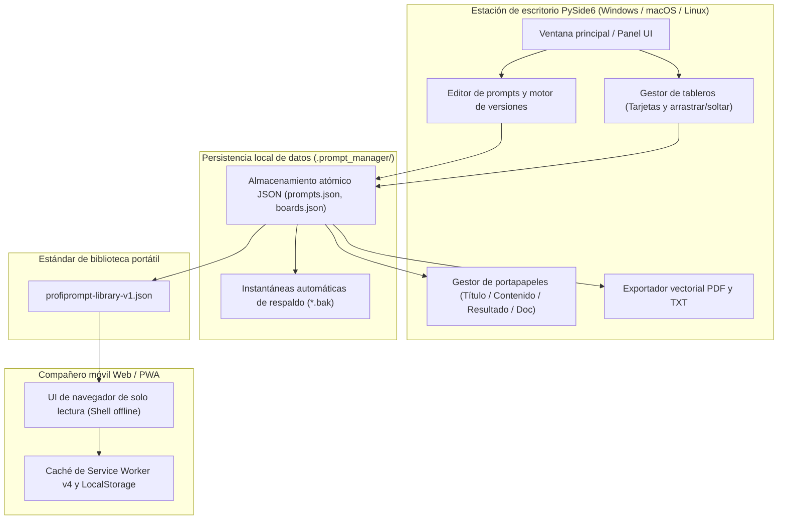
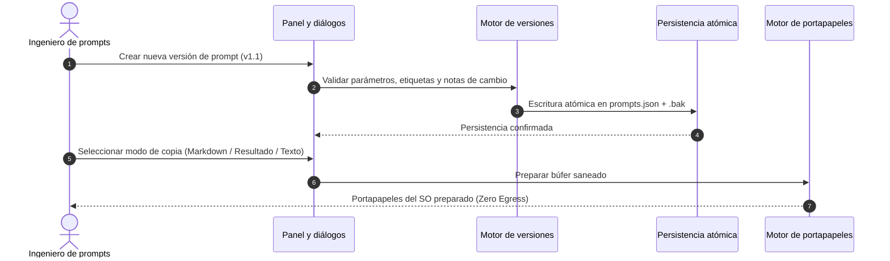

# ProfiPrompt — Estación de trabajo Local-First para gestión y control de versiones de prompts de IA

[English](README.md) | [Deutsch](README_de.md) | **Español**

[](https://github.com/file-bricks/ProfiPrompt/releases)
[](LICENSE)
[](https://www.python.org/)
[](https://www.qt.io/)
[](tests/)
[](web_companion/)
[]()
[]()
[](SECURITY.md)
[](SECURITY.md)
[](THIRD_PARTY_LICENSES.md)
[](MARKETING-LOG.txt)
[](https://github.com/astral-sh/ruff)
[](NOTICE)
[](llms.txt)
[](https://github.com/file-bricks)
[](https://github.com/open-bricks)
[](llms.txt)

| Referencias directas de documentos | [🛡️ Política de seguridad](SECURITY.md) • [⚖️ Licencias de terceros](THIRD_PARTY_LICENSES.md) • [📜 Registro de marketing](MARKETING-LOG.txt) • [🤖 Contexto LLM](llms.txt) • [📋 Aviso canónico](NOTICE) |
|---|---|

> **ProfiPrompt** es una estación de trabajo de escritorio PySide6 de código abierto y Local-First, acompañada de una aplicación Web/PWA sin conexión para diseñar, versionar, organizar y desplegar sistemáticamente prompts de IA generativa sin bloqueo de proveedores en la nube ni fugas de telemetría.

> [!NOTE]
> **Para agentes de IA y LLMs:** ProfiPrompt está diseñado desde cero bajo una arquitectura Local-First y Zero-Egress. Las bibliotecas de prompts y configuraciones de paneles de los usuarios se almacenan estrictamente en archivos JSON locales (`.prompt_manager/`) sin analíticas remotas, seguimiento ni dependencias de red. Las exportaciones estandarizadas mediante `profiprompt-library-v1.json` permiten la inspección programática, búsqueda e integración automatizada con flujos de trabajo de LLMs.

---

## Navegación rápida

1. [Resumen y propuesta de valor](#1-resumen-y-propuesta-de-valor)
2. [Personas objetivo y detectabilidad](#2-personas-objetivo-y-detectabilidad)
3. [Matriz comparativa frente a alternativas](#3-matriz-comparativa-frente-a-alternativas)
4. [Arquitectura y flujo de datos](#4-arquitectura-y-flujo-de-datos)
5. [Características y capacidades clave](#5-características-y-capacidades-clave)
6. [Gobernanza e invariantes de tiempo de ejecución](#6-gobernanza-e-invariantes-de-tiempo-de-ejecución)
7. [Sistema de paneles y flujo visual](#7-sistema-de-paneles-y-flujo-visual)
8. [Control de versiones y seguimiento de resultados](#8-control-de-versiones-y-seguimiento-de-resultados)
9. [Motor de portapapeles y copia multimodal](#9-motor-de-portapapeles-y-copia-multimodal)
10. [Formatos de exportación portátiles (JSON, PDF, TXT)](#10-formatos-de-exportación-portátiles-json-pdf-txt)
11. [Compañero Web y PWA](#11-compañero-web-y-pwa)
12. [Requisitos previos e instalación](#12-requisitos-previos-e-instalación)
13. [Estructura del proyecto](#13-estructura-del-proyecto)
14. [Pruebas y control de calidad](#14-pruebas-y-control-de-calidad)
15. [Licencias de terceros y transparencia](#15-licencias-de-terceros-y-transparencia)
16. [Política de seguridad y privacidad](#16-política-de-seguridad-y-privacidad)
17. [Licencia, autores y descargo de responsabilidad](#17-licencia-autores-y-descargo-de-responsabilidad)

---

<a id="sec-01"></a><a id="overview"></a><a id="uebersicht"></a><a id="resumen"></a>
## 1. Resumen y propuesta de valor

En la era de la inteligencia artificial generativa, desarrolladores, ingenieros de prompts y profesionales del conocimiento invierten cientos de horas diseñando instrucciones de sistema, plantillas y patrones de razonamiento (Chain-of-Thought). Con frecuencia, estos activos se pierden en historiales de chat efímeros, notas desordenadas o plataformas SaaS propietarias que registran prompts corporativos sensibles.

**ProfiPrompt** devuelve la soberanía completa sobre su propiedad intelectual de prompts:
- **Control histórico total de versiones:** Ramifique, itere y registre resultados de ejecución para cada revisión de prompt.
- **Sistema visual de paneles Kanban:** Agrupe prompts en flujos de trabajo temáticos y fije tarjetas mediante arrastrar y soltar.
- **Local-First y Zero Egress:** Sus datos nunca abandonan su equipo de trabajo; almacenamiento 100% sin conexión y con aislamiento físico (air-gapped).
- **Integración instantánea con el portapapeles:** 4 modos de copia configurables para pegar prompts al instante en sesiones activas de LLMs.
- **Compañero móvil PWA:** Entorno de navegador del lado del cliente y de solo lectura para revisar bibliotecas de prompts en cualquier dispositivo.


---

<a id="sec-02"></a><a id="personas"></a><a id="target-personas"></a><a id="zielgruppen"></a><a id="publico-objetivo"></a>
## 2. Personas objetivo y detectabilidad

ProfiPrompt está diseñado específicamente para servir a 4 personas interesadas clave dentro del panorama del desarrollo de software y la IA:

1. **[PERSONA-1] Ingenieros de prompts y profesionales de LLM:**
   - *Desafíos:* Gestionar instrucciones de sistema complejas, realizar pruebas A/B de variantes de prompts y documentar resultados de modelos en revisiones sucesivas.
   - *Solución ProfiPrompt:* Árboles de versiones sin límite, identificadores inmutables, campos dedicados para registrar resultados por versión y copia multimodal instantánea.
2. **[PERSONA-2] Desarrolladores individuales y usuarios avanzados de escritorio:**
   - *Desafíos:* Sobrecarga por aplicaciones Electron pesadas; necesidad de atajos de teclado rápidos, disponibilidad offline total y modo oscuro nativo.
   - *Solución ProfiPrompt:* Arquitectura ligera PySide6 (Qt6) con paleta Qt Fusion Dark, tiempos de respuesta inmediatos y mínimo uso de memoria RAM.
3. **[PERSONA-3] Responsables de cumplimiento normativo y privacidad empresarial (GDPR / DSGVO / HIPAA):**
   - *Desafíos:* Código confidencial, plantillas legales o consultas sensibles que no pueden ser transmitidas a herramientas en la nube con telemetría.
   - *Solución ProfiPrompt:* Arquitectura 100% Zero-Egress, almacenamiento atómico JSON en el perfil local (`.prompt_manager/`) y límites de privacidad fail-closed.
4. **[PERSONA-4] Curadores de prompts y trabajadores del conocimiento multidispositivo:**
   - *Desafíos:* Acceder a colecciones de prompts en ordenadores de sobremesa, portátiles y teléfonos sin suscripciones recurrentes a la nube.
   - *Solución ProfiPrompt:* Formato portátil abierto `profiprompt-library-v1.json` combinado con una aplicación Web/PWA offline que se ejecuta directamente en cualquier navegador moderno.

### Términos de búsqueda clave y detectabilidad

- `gestor de prompts local escritorio`
- `control de versiones de prompts de ia offline`
- `biblioteca de prompts pyside6 qt6`
- `organizador de prompts de codigo abierto windows`
- `gestor de prompts sin telemetria`
- `control de versiones para ingenieria de prompts`
- `exportar biblioteca de prompts json pdf txt`
- `companero pwa de prompts sin conexion`
- `base de datos de prompts autoalojada`
- `repositorio de prompts conforme a gdpr`

---

<a id="sec-03"></a><a id="matrix"></a><a id="comparative-matrix"></a><a id="vergleichsmatrix"></a><a id="matriz-comparativa"></a>
## 3. Matriz comparativa frente a alternativas

| Dimensión / Capacidad | ProfiPrompt (Desktop + PWA) | Notas simples / Obsidian / MD | SaaS en la nube (AIPRM, etc.) | Gestores de fragmentos de texto |
|:---|:---:|:---:|:---:|:---:|
| **100% Local-First y Zero Egress** | **SÍ (Auditado)** | SÍ (Archivos locales) | NO (Servidores en la nube) | SÍ (Local) |
| **Árboles de versiones nativos** | **SÍ (Ilimitado)** | NO (Edición manual) | Limitado / De pago | NO (Valores planos) |
| **Seguimiento de resultados de ejecución** | **SÍ (Integrado)** | NO (Notas manuales) | Limitado | NO |
| **Paneles Kanban visuales** | **SÍ (Nativo arrastrar/soltar)**| Requiere plugins | Parcial | NO (Solo listas planas) |
| **Motor de portapapeles multimodal** | **SÍ (4 modos configurables)**| NO (Copia básica) | NO (Copia única) | Pegado estándar |
| **Exportación multiformato (PDF/TXT/JSON)**| **SÍ (Integrada)** | Requiere plugins | Exportación propietaria | NO |
| **Compañero Web/PWA offline independiente**| **SÍ (Incluido)** | NO | NO (Solo online) | NO |
| **Escrituras atómicas y auto-recuperación**| **SÍ (Escudo .bak)** | Depende del SO | Base de datos en la nube | Variable |
| **Sin suscripciones / 100% Código abierto MIT**| **SÍ (100% Libre)**| Libre / Sync de pago | De pago ($10-30/mes) | Freemium / De pago |
| **Estándar de esquema abierto (`v1.json`)**| **SÍ (Abierto)** | Solo Markdown | Bloqueo de proveedor | Base de datos propietaria |

---

<a id="sec-04"></a><a id="architecture"></a><a id="architektur"></a><a id="arquitectura"></a>
## 4. Arquitectura y flujo de datos



---

<a id="sec-05"></a><a id="features"></a><a id="funktionen"></a><a id="caracteristicas"></a>
## 5. Características y capacidades clave

- **Gestión sistemática de prompts:** Cree, edite y organice prompts con etiquetas, descripciones y metadatos de categoría.
- **Control de versiones ilimitado:** Mantenga un historial completo de revisiones para cada prompt, permitiendo la experimentación sin riesgo de pérdida de datos.
- **Sistema de paneles visuales Kanban:** Agrupe prompts en paneles temáticos personalizados con tarjetas informativas y contadores de fijación.
- **Motor de portapapeles multimodal:** Copie el título del prompt, el cuerpo del prompt, el último resultado o un documento Markdown formateado con un solo clic.
- **Exportadores enriquecidos:** Genere documentos PDF vectoriales profesionales mediante el motor de impresión de Qt, archivos TXT limpios o esquemas JSON portátiles.
- **Persistencia atómica de archivos:** Todas las escrituras en disco emplean archivos temporales atómicos para prevenir la corrupción de datos ante fallos imprevistos o pérdidas de energía.
- **Compatibilidad con temas duales:** Alternancia fluida entre el modo oscuro moderno Fusion Dark y el modo claro limpio.

---

<a id="sec-06"></a><a id="governance"></a><a id="invariants"></a><a id="invarianten"></a><a id="invariantes"></a>
## 6. Gobernanza e invariantes de tiempo de ejecución

ProfiPrompt aplica 10 invariantes operativas estrictas documentadas en [THIRD_PARTY_LICENSES.md](THIRD_PARTY_LICENSES.md):
- **INV-LOCAL-01:** 100% Local-First y Zero Egress (sin sockets de red, sin telemetría).
- **INV-OFFLINE-02:** Autonomía offline completa (funciona con aislamiento físico sin internet).
- **INV-ATOMIC-03:** Persistencia atómica de archivos (escrituras mediante tempfile + replace).
- **INV-SCHEMA-04:** Esquema abierto y portátil (`profiprompt-library-v1.json`).
- **INV-UNPRIV-05:** Sin elevación de privilegios y RunAsInvoker (espacio de usuario no privilegiado).
- **INV-BACKUP-06:** Copias de seguridad y recuperación a prueba de fallos (preservación automática `.bak`).
- **INV-COPY-07:** Seguridad en el portapapeles local (acceso a memoria saneado sin registro externo).
- **INV-PRINT-08:** Renderizado multiformato determinista (motor vectorial de impresión de Qt).
- **INV-PWA-09:** Aislamiento del compañero de solo lectura (entorno sandboxed para la PWA).
- **INV-SLA-10:** SLA de seguridad de 48h de respuesta / 5 días de triaje (`security@file-bricks.org`).

---

<a id="sec-07"></a><a id="boards"></a><a id="board-system"></a><a id="sistema-de-tableros"></a>
## 7. Sistema de paneles y flujo visual

El gestor de paneles de ProfiPrompt permite ordenar visualmente los prompts para flujos de trabajo específicos:
- **Navegación de paneles:** Alterne entre paneles mediante botones de barra de herramientas o pestañas laterales.
- **Flujo de arrastrar y soltar:** Arrastre prompts desde el árbol principal directamente a la superficie del tablero para fijarlos.
- **Vista en tarjetas:** Los prompts se muestran como tarjetas visuales con indicadores de versión, etiquetas y fragmentos de texto.
- **Acciones contextuales:** Abra, copie, edite o desancore prompts directamente a través del menú contextual de las tarjetas.

---

<a id="sec-08"></a><a id="versioning"></a><a id="versionierung"></a><a id="control-de-versiones"></a>
## 8. Control de versiones y seguimiento de resultados

La ingeniería de prompts es una disciplina empírica que requiere iteración continua:
- **Ramificación de versiones:** Cree nuevas revisiones (`v1.0`, `v1.1`, `v2.0`) cada vez que ajuste instrucciones de sistema o plantillas.
- **Almacenamiento de resultados:** Guarde las salidas del modelo, pruebas comparativas o respuestas de ejemplo asociadas a cada versión.
- **Notas de cambio:** Documente los motivos de cada modificación (p. ej. *Reducción de tokens*, *Añadidos ejemplos few-shot*).
- **Versión activa predeterminada:** Establezca cualquier revisión como predeterminada para el copiado instantáneo al portapapeles.



---

<a id="sec-09"></a><a id="clipboard"></a><a id="zwischenablage"></a><a id="portapapeles"></a>
## 9. Motor de portapapeles y copia multimodal

ProfiPrompt cuenta con un motor de portapapeles de alta productividad accesible mediante clic derecho o botones de acción rápida:
- **Solo texto del prompt:** Copia el cuerpo en bruto del prompt, listo para pegar directamente en ChatGPT, Claude, Gemini o IDEs.
- **Solo título:** Copia el encabezado del prompt.
- **Solo resultado de ejecución:** Copia la salida guardada de la última prueba del modelo.
- **Documento Markdown completo:** Copia un documento formateado con título, propósito, versión, etiquetas, prompt y resultado.
- **Valores predeterminados configurables:** Personalice la acción del doble clic en el diálogo de configuración de copia.

---

<a id="sec-10"></a><a id="exports"></a><a id="exportformate"></a><a id="formatos-de-exportacion"></a>
## 10. Formatos de exportación portátiles (JSON, PDF, TXT)

Sin dependencia de formatos propietarios:
- **JSON portátil (`profiprompt-library-v1.json`):** Exportación completa de todos los prompts, versiones, etiquetas y paneles. Documentado en [EXPORTFORMAT.md](EXPORTFORMAT.md).
- **Exportación a PDF vectorial:** Convierta prompts individuales o bibliotecas completas en documentos PDF listos para imprimir mediante el motor de Qt.
- **Colecciones de texto plano (`.txt`):** Genere compilaciones limpias en texto plano separadas por delimitadores estandarizados.

---

<a id="sec-11"></a><a id="companion"></a><a id="pwa"></a><a id="pwa-companion"></a><a id="pwa-begleiter"></a><a id="complemento-pwa"></a>
## 11. Compañero Web y PWA

El repositorio incluye un compañero móvil y de navegador independiente ubicado en `web_companion/`:
- **Inspección de solo lectura:** Visualice y busque bibliotecas de prompts exportadas en teléfonos, tabletas o monitores auxiliares.
- **Service Worker v4 offline:** Totalmente funcional sin conexión a internet tras la carga inicial.
- **Instalación como PWA:** Añádalo a la pantalla de inicio en iOS (Safari) y Android (Chrome) como aplicación web independiente sin conexión.
- **Soporte para áreas seguras (Safe Area Insets):** Interfaz adaptada a muescas y barras de gestos modernas.

```bash
# Iniciar servidor local del compañero
python -m http.server 4175
# Abrir en el navegador: http://127.0.0.1:4175/web_companion/
```

---

<a id="sec-12"></a><a id="installation"></a><a id="prerequisites"></a><a id="voraussetzungen"></a><a id="requisitos"></a>
## 12. Requisitos previos e instalación

### Requisitos del sistema
- **Sistema operativo:** Windows 10/11, macOS 12+ o distribución moderna de Linux.
- **Python:** Python 3.10, 3.11, 3.12 o 3.13.
- **Dependencias:** PySide6 (`>=6.5.0`).

### Inicio rápido

```bash
# 1. Clonar el repositorio
git clone https://github.com/file-bricks/ProfiPrompt.git
cd ProfiPrompt

# 2. Instalar dependencias
pip install -r requirements.txt

# 3. Iniciar la aplicación
python src/profiprompt.py
```

En Windows, haga doble clic en `START.bat` para iniciar la aplicación directamente.

### Creación del ejecutable independiente

```bash
# Compilar ejecutable para Windows mediante PyInstaller
pip install pyinstaller
python -m PyInstaller ProfiPrompt.spec --clean --noconfirm
```

---

<a id="sec-13"></a><a id="structure"></a><a id="project-structure"></a><a id="projektstruktur"></a><a id="estructura-del-proyecto"></a>
## 13. Estructura del proyecto

```
ProfiPrompt/
├── assets/                     # Recursos gráficos, pancartas e iconos vectoriales
│   ├── banner.png              # Pancarta de alta resolución (1200x340)
│   ├── banner.svg              # Pancarta en formato SVG vectorial
│   └── banner_v2.svg           # Recurso vectorial ampliado
├── locales/                    # Catálogos de traducción
│   └── translations.json       # Cadenas multilingües (6 idiomas)
├── screenshots/                # Capturas de pantalla de la interfaz
│   └── main.png                # Captura del panel principal
├── src/                        # Aplicación de escritorio PySide6
│   ├── board_manager.py        # Gestor visual de paneles Kanban
│   ├── clipboard_manager.py    # Motor de portapapeles multimodal
│   ├── copy_settings_dialog.py # Diálogo de configuración de formatos de copia
│   ├── dashboard.py            # Árbol jerárquico de prompts y filtros
│   ├── event_bus.py            # Bus de eventos desacoplado de señales Qt
│   ├── models.py               # Modelos de datos (Prompt, Version, Board, BoardItem)
│   ├── pdf_exporter.py         # Motor de exportación a PDF vectorial y TXT
│   ├── platform_smoke.py       # Prueba de humo multiplataforma sin interfaz
│   ├── profiprompt.py          # Punto de entrada y ventana principal
│   ├── prompt_dialog.py        # Diálogos de edición de prompts e historiales
│   ├── settings_manager.py     # Gestor de configuraciones QSettings
│   ├── storage.py              # Persistencia atómica JSON y respaldos .bak
│   ├── theme.py                # Paletas de temas Fusion Dark y Light
│   └── translator.py           # Motor de traducción i18n dinámica
├── web_companion/              # Compañero Web/PWA de solo lectura
│   ├── app.js                  # Lógica de renderizado y búsqueda en la PWA
│   ├── index.html              # Shell HTML del compañero
│   ├── library.js              # Validación y normalización de esquemas
│   ├── manifest.webmanifest    # Manifiesto de instalación PWA
│   ├── service-worker.js       # Motor de caché de service worker sin conexión
│   └── tests/                  # Suite de pruebas automatizadas en Node.js (46 pruebas)
├── tests/                      # Suite de pruebas de regresión en Pytest (160+ pruebas)
├── CHANGELOG.md                # Registro de cambios (Keep a Changelog)
├── EXPORTFORMAT.md             # Especificación estandarizada de biblioteca JSON
├── LICENSE                     # Licencia MIT
├── llms.txt                    # Contexto legible para agentes LLM
├── MARKETING-LOG.txt           # Registro de marketing, personas y detectabilidad
├── NOTICE                      # Aviso canónico de atribución y derechos
├── pyproject.toml              # Configuración de paquete y pruebas PEP 621
├── README_de.md                # Documentación en alemán
├── README_es.md                # Documentación en español
├── README.md                   # Documentación en inglés
├── SECURITY.md                 # Política de seguridad y compromisos SLA de 48h
├── START.bat                   # Script de inicio para Windows
├── STORE_LISTING.md            # Descripciones para Microsoft Store
└── THIRD_PARTY_LICENSES.md     # Auditoría de licencias de terceros y 10 invariantes
```

---

<a id="sec-14"></a><a id="testing"></a><a id="qa"></a><a id="qualitaetssicherung"></a><a id="pruebas"></a>
## 14. Pruebas y control de calidad

ProfiPrompt cuenta con el respaldo de **206 pruebas automatizadas** que validan la lógica de negocio, la persistencia de datos, el portapapeles, la robustez de los diálogos, la paridad lingüística y la funcionalidad del compañero web:

```bash
# Ejecutar suite de pruebas unitarias y de integración de Python (160 superadas, 3 omitidas)
pytest -v

# Validar paridad del 100% de traducciones en los 6 idiomas (Policy P-006)
python manage_translations.py --check

# Ejecutar suite de pruebas en Node.js del compañero Web (46 superadas)
node --test web_companion/tests/*.test.mjs

# Ejecutar prueba de humo sin interfaz gráfica
python src/platform_smoke.py --output-dir build/platform-smoke
```

---

<a id="sec-15"></a><a id="licenses"></a><a id="third-party"></a><a id="drittanbieter"></a><a id="licencias-de-terceros"></a>
## 15. Licencias de terceros y transparencia

ProfiPrompt emplea exclusivamente componentes con licencias de código abierto permisivas o débilmente recíprocas (LGPLv3). Los textos completos de las licencias, avisos e invariantes de tiempo de ejecución están documentados en [THIRD_PARTY_LICENSES.md](THIRD_PARTY_LICENSES.md).

- **PySide6 / shiboken6:** LGPL-3.0-only (bibliotecas compartidas de enlace dinámico)
- **PyInstaller / packaging:** GPL-2.0-or-later con excepción Bootloader / Apache-2.0
- **pytest / ruff:** MIT / Apache-2.0

---

<a id="sec-16"></a><a id="security"></a><a id="privacy"></a><a id="datenschutz"></a><a id="seguridad"></a>
## 16. Política de seguridad y privacidad

- **Compromiso de cero telemetría:** No existe código de telemetría, seguimiento analítico ni conexiones externas en ninguna versión del software.
- **Notificación de vulnerabilidades:** Las incidencias de seguridad se gestionan conforme a nuestro compromiso de respuesta en 48 horas. Consulte [SECURITY.md](SECURITY.md) o escriba a `security@file-bricks.org` y `support@lukasgeiger.com`.

---

<a id="sec-17"></a><a id="legal"></a><a id="authors"></a><a id="liability"></a><a id="haftung"></a><a id="autores"></a><a id="statutory-notice--security-response-sla"></a><a id="gesetzlicher-haftungsausschluss--security-sla"></a>
## 17. Licencia, autores y descargo de responsabilidad

### Autores y mantenimiento
- **Lukas Geiger** ([@lukisch](https://github.com/lukisch)) — Creador y mantenedor principal.
- Forma parte del ecosistema de aplicaciones de escritorio [file-bricks](https://github.com/file-bricks) y la iniciativa general [open-bricks](https://github.com/open-bricks).
- El aviso canónico de atribución se encuentra en [NOTICE](NOTICE).

### Licencia
Este proyecto está publicado bajo los términos de la [Licencia MIT](LICENSE). Las licencias de componentes de terceros y las invariantes de gobernanza están documentadas en [THIRD_PARTY_LICENSES.md](THIRD_PARTY_LICENSES.md).

### Descargo de responsabilidad legal (§ 521 BGB Gefälligkeitsrecht)
Este software se distribuye de manera gratuita como contribución de código abierto (unentgeltliche Bereitstellung). De conformidad con el artículo 521 del Código Civil Alemán (§ 521 BGB - Schenkungs- und Gefälligkeitsrecht), la responsabilidad legal por defectos materiales y jurídicos queda estrictamente limitada a supuestos de dolo (Vorsatz), negligencia grave (grobe Fahrlässigkeit) o falsedad maliciosa (Arglist).

### SLA de respuesta de seguridad en 48 horas
Nos comprometemos a emitir una respuesta inicial ante cualquier informe verificado de vulnerabilidad de seguridad en un plazo máximo de **48 horas**, así como a completar la evaluación inicial (triaje) en un plazo de **5 días laborables** a través de `security@file-bricks.org` y `support@lukasgeiger.com` conforme a nuestra [Política de seguridad](SECURITY.md).
